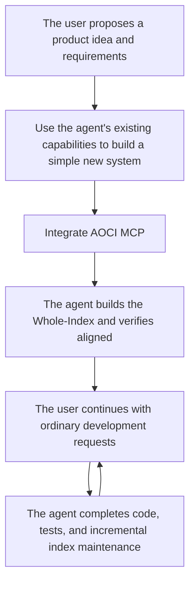
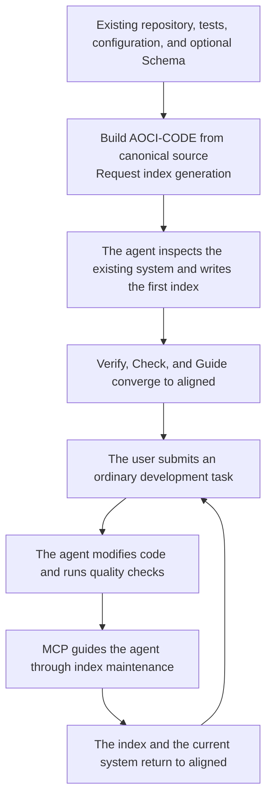

# AOCI-CODE

**A persistent, Git-versioned map of your entire codebase — written by your coding agent, governed by a local MCP server.** Agents read it once and know the system, instead of re-reading the repo on every task.

🇺🇸 English | [🇨🇳 简体中文](README.zh-CN.md)


## What it does

**Build large systems without losing the plot.** In Codex, Claude Code, Cursor, OpenCode, and similar agents, your agent starts every task already knowing the whole system: what each file is for, what it depends on, and what must not break. It stops searching and re-reading the codebase for every request. People who are not professional developers can keep iterating on their own systems; professional developers can hand the whole system to an agent and keep their attention on architecture and design.

**Take over an existing system in one step.** Point the agent at an existing codebase of up to about 500,000 lines and ask it to build the index. It reports how well it knows each area, then picks up development from there. The practical limit is the size of the index, not the line count: a 700,000-line commercial system is developed this way today, with an index of about 300K tokens.

**Change people, agents, or conversations without starting over.** The index lives in the repository next to the code and is versioned by Git. When a project changes hands, switches agents, or opens a new conversation, one read of the index picks up where things left off.

**After the first index, maintenance is automatic.** The MCP server detects code changes and issues the entries that need updating. The agent fills them in as it finishes each task, so the index matches the current code and you never stop to maintain it.

## What it looks like

One line per file, written by the model from the actual source. This is a real entry from this repository's own index:

```text
atomic.go[CG9L]: F:Provides durable replace CAS, create CAS, atomic writes, and no-clobber recovery moves | R:code:internal/fs/atomic_exchange_linux.go,code:internal/fs/atomic_exchange_windows.go,code:internal/fs/lock.go | A:AtomicWrite,AtomicWriteCAS,AtomicCreateCAS,AtomicMoveCAS | S:Native publication never degrades to an overwriting rename; on a race, unsafe type, or unverifiable bytes, preserve third-party state
```

**F** is what the file is responsible for, **R** is what you have to read along with it, **A** is what callers depend on, and **S** is what you cannot infer from the code but must not get wrong. The tag `[CG9L]` places the file by layer, domain, importance, and size. A few hundred lines like this cover a whole system, and an agent can read them in one pass. [The entry format](#what-one-entry-records-fras) explains each field.

## What to expect

**The first index takes a while.** The agent reads every managed file and writes one entry per file: about an hour per 200,000 lines of code, depending on the model and the agent's speed. It runs in batches and resumes where it stopped if interrupted.

**Have a database? Index it too.** MySQL and PostgreSQL are supported, and openGauss 6.0.5 with constraints. Build the code index first, then the database index. With code and table-level knowledge delivered together, the agent understands the system more completely.

**Local only: read-only on your system, no Internet, no stored credentials.** AOCI-CODE reads your source code and database table structures, never business data. It writes its index files and its own state inside the project directory, plus the status page's registration in your user cache directory. It never reaches the Internet and uploads nothing: the only connections it opens are to the database you declare, for catalog metadata, and to its own loopback status page. Database credentials are referenced by environment-variable name and never stored. The index text is written locally by your own agent through the model channel you already use; AOCI-CODE adds no new data exit.

## Quick start

Give your agent the following instruction to download AOCI-CODE and wire it up. After you restart the agent, send the second instruction to build the index.

```text
AOCI-CODE project: https://github.com/aoci-spec/aoci-code

Download the latest release package for this operating system and CPU architecture from
https://github.com/aoci-spec/aoci-code/releases, and follow the installation instructions
on the Release page to verify it. If no compatible release package exists, or if I
explicitly request the latest source, build it from the official repository.

After extracting the package, place aoci (aoci.exe on Windows) at a stable absolute path.
Then use that absolute path to do the following for my project:

1. Run init to initialize AOCI and integrate MCP for the current host; if this host does
   not write project configuration (Cursor, for example), give me the configuration I
   need to paste myself
2. Run scan

   scan takes its file inventory from Git, so do not add the cognition assets
   init writes (aoci.txt, aoci.meta.txt, aoci.code.txt, AGENTS.md) to .gitignore
   or .git/info/exclude — an ignored asset is silently skipped and the index
   cannot be built. Leave the host-config ignore init writes for itself as it is.

3. Tell me to restart the agent so the newly written MCP server takes effect

Stop after those three steps and do not build the index yet — I will tell you to continue
after the restart.
```

After restarting the agent, send this one:

```text
First confirm the AOCI MCP server is connected, then build the AOCI index for this project. When it is complete, give me the AOCI panel link.
```

The agent starts the panel in the background with `aoci ui --detach --json` and hands you the link. [AOCI panel](#aoci-panel) covers what it shows and its other commands.

Why the restart: the index is written through AOCI's MCP tools, and the session that ran `init` has not loaded the MCP server `init` just wrote. A host that loads MCP servers dynamically may not need a restart; [Host integration](#host-integration) explains how to tell.

If your project has a database (PostgreSQL and MySQL are supported, plus constrained openGauss 6.0.5), index it as well. Declare the source as described under [Database Cognition](#database-cognition), provide the connection-string environment variable in the host environment (AOCI stores no credentials), then send:

```text
Build the AOCI database index for this project.
```

If the context has been compacted, or you want the agent to rebuild its picture of the system, send this:

```text
Using only AOCI, establish whole-framework cognition of this project, tell me your mastery of each area as a percentage, and whether you can take over development.
```

## How it works

**AOCI (AI-Oriented Cognition Infrastructure)** is the method and protocol: a layer between coding agents and software systems. Models reason, agents plan and execute, and AOCI keeps an up-to-date description of the system, covering code, configuration, tests, and database structure, for agents to read before they act. **AOCI-CODE** is this project: the `aoci` CLI, the MCP server, and the index they maintain.

AOCI-CODE distills what actually matters for understanding and changing a system into a dense, plain-text index that combines symbols and meaning. When model context is limited, an agent reads the index first, gets most of the project's key information in one pass, and then starts the task. That cuts repeated searching and re-learning, and it carries understanding across tasks and sessions.

- **Not a one-time summary.** The index evolves with the system and stays in the project, where you can diff, review, version, and roll it back with Git.
- **More than "where files are."** It records responsibilities, strong relationships, public contracts, transaction boundaries, compatibility constraints, and other things that are hard to infer from code structure.
- **Portable.** The index is stored with the project, not tied to a model, an agent, or a session. While it is aligned with the code, any agent and any later session can reuse it without rebuilding its understanding from scratch.
- **Code and databases together.** The model can build a separate table-level index for database tables. Delivered together, the two give the agent a fuller picture of the system.

The index is a set of governed plain-text files stored with the project:

- **Root (`aoci.txt`)** declares what makes up the current index and is its activation entry point.
- **Meta (`aoci.meta.txt`)** holds the tag dictionary, the FRAS rules, and the authoring constraints.
- **Code (`aoci.code.txt`)** holds the model-authored entries for code and other repository assets.
- **Database (`aoci.database.txt`)** holds optional table-level entries when Database Cognition is enabled.

Root, Meta, and the participating object Volumes together form the Whole-Index. The workflow on top of them has three stages:

1. **Build the index under governance.** The model reads source code and accepted evidence. AOCI-CODE governs Managed Scope and the entries the model writes for every managed object with the `index` role.
2. **Read before acting.** The agent reads the project rules, the live guide, and the current Whole-Index, then checks source and other evidence for the task at hand.
3. **Maintain after verified change.** Once code and tests are stable, the project rules and the MCP workflow have the agent update the affected entries and bring the index back to `aligned`.

Because these files are plain text in the repository, Git versions them. While the index stays aligned with the current system version, any agent and any later session can read and reuse the same Whole-Index.

## Manual integration

Get AOCI-CODE from the canonical source or use a signed package from GitHub Releases. Before using a prebuilt binary, follow the basic, recommended, or full verification level in the [installation guide](https://github.com/aoci-spec/aoci-code/blob/v0.1.0-rc14/docs/install.md#signed-github-release-packages), and report which level completed. Give this README and the verified binary's stable absolute path to a coding agent you trust, such as Codex, Claude Code, Cursor, or OpenCode. The agent can follow the in-project instructions to initialize AOCI, integrate MCP, and build the first index.

How long the first index takes depends on repository size. A normal integration is four steps: prepare the binary, have the agent or yourself initialize the target repository, ask the host to "build the index," and verify alignment. After that you do not need to end every request with "maintain the index." The project rules and the MCP workflow have the agent maintain the index incrementally whenever managed objects change.

### Requirements

- A verified release package or a checkout of the canonical AOCI-CODE source repository.
- For source builds only: the Go toolchain declared by `go.mod`, `make`, and the other tools the repository requires.
- A supported MCP host, such as Codex, Claude Code, Cursor, or OpenCode.
- Normal read and write access to the target repository.

AOCI-CODE integrates with the MCP host, not with a model-provider API. DeepSeek
and other models can use AOCI-CODE when the agent or host running them supports
standard stdio MCP and can follow the tool contract; a model name alone does not
establish compatibility.

The signed-package route and executable verification commands are in the [installation guide](https://github.com/aoci-spec/aoci-code/blob/v0.1.0-rc14/docs/install.md#signed-github-release-packages). The source-build route is below.

### Current RC: use a verified package or build from source

> [!IMPORTANT]
> AOCI-CODE v0.1.0-rc14 is the current release candidate. It is Fair Source/source-available software under FSL-1.1-MIT; see [LICENSE](LICENSE). Build from canonical source or use a signed package from the [v0.1.0-rc14 GitHub Release](https://github.com/aoci-spec/aoci-code/releases/tag/v0.1.0-rc14) after following the [release verification procedure](https://github.com/aoci-spec/aoci-code/blob/v0.1.0-rc14/docs/install.md#signed-github-release-packages).

The signed Release binary identifies itself as `aoci version 0.1.0-rc14`. A
source build identifies the exact checkout instead and may report a development
version such as `v0.1.0-rc14-1-g<short-commit>` (plus `-dirty` when applicable),
together with its Git commit. These are different build inputs, not a version
conflict.

To download with GitHub CLI, authenticate first, then download the tagged
Release assets:

```bash
gh auth login
gh release download v0.1.0-rc14 --repo aoci-spec/aoci-code
```

For an anonymous download, open the
[v0.1.0-rc14 Release page](https://github.com/aoci-spec/aoci-code/releases/tag/v0.1.0-rc14)
in a browser and download the archive and verification assets you need.

To build from source, clone the canonical repository, build the binary, and keep the resulting path stable:

```bash
git clone https://github.com/aoci-spec/aoci-code.git
cd aoci-code
mkdir -p build
make build
./build/aoci --version
```

On Windows, build the same source in PowerShell:

```powershell
git clone https://github.com/aoci-spec/aoci-code.git
Set-Location .\aoci-code
New-Item -ItemType Directory -Force .\build | Out-Null
make build
.\build\aoci.exe --version
```

Then give this README to an agent you already trust with the project and ask:

```text
Read this AOCI-CODE README and use the built aoci binary at its stable absolute path
to initialize AOCI for the current project, integrate MCP, and run scan. Stop there and
tell me to restart the agent; I will ask you to build the index afterwards.
```

The agent should identify the project root, use a stable absolute path to the built binary, run the initialization that fits the current host, and tell you clearly when a host restart or real human approval is required. The binary can stay in the AOCI-CODE checkout or move to a shared tools directory, as long as the MCP configuration points at the correct absolute path.

### Manual initialization

To initialize AOCI yourself, run the following from the target repository root, or pass an explicit path through `--repo`:

```bash
AOCI=/absolute/path/to/aoci-code/build/aoci
"$AOCI" --repo . init --locale en-US --agent codex
"$AOCI" --repo . scan
```

`init` writes the locale configuration, the managed `AGENTS.md` rules block, the Git boundaries, and an empty index skeleton. Configuration and prompting vary by host; see [Host integration](#host-integration). It does not invent business meaning from filenames, directories, or an AST.

For a new repository, the first `scan` establishes the managed Baseline. For a project that already has a governed Baseline, adding, removing, or changing managed scope goes through the formal Scope Change workflow; `scan --force` is not a shortcut for redefining governance facts. `--force` also cannot erase unresolved drift, receipts, or recovery boundaries.

<details>
<summary>Windows PowerShell</summary>

```powershell
$Aoci = (Resolve-Path "C:\path\to\aoci-code\build\aoci.exe").Path
& $Aoci --repo . init --locale en-US --agent codex
& $Aoci --repo . scan
```

Confirm that `$Aoci` points to a stable absolute path.

</details>

### Have the agent build the first index (important)

Once initialization and `scan` are done, check whether the agent session already exposes the AOCI tools; refresh or restart it if not. Then enter the following in the agent for the target project:

```text
First confirm the AOCI MCP server is connected, then build the AOCI index for this project. When it is complete, give me the AOCI panel link.
```

The agent starts the panel in the background with `aoci ui --detach --json` and hands you the link. [AOCI panel](#aoci-panel) covers what it shows and its other commands.

The host reads the project's AOCI rules and live guide, inspects source code, tests, configuration, and relevant evidence, and then writes FRAS candidates for every managed object whose role is `index`. You do not need to orchestrate Plan, Stage, Check, Diff, CAS, or Apply yourself.

Once the first index is complete, send ordinary development requests as usual, for example:

```text
Add priorities to tasks, including the frontend, backend, database, and test changes.
```

You do not need to append "maintain the AOCI index at the end." The project rules and MCP have the agent check for index changes once code and tests are stable, then update the affected entries through the formal workflow. When the project uses `automation.mode=auto`, AOCI-CODE interrupts you only when real human approval is required, an external action must be performed, recovery cannot be proven, a safety check fails, or a third-party concurrency conflict is found. Other automation modes follow their own runtime contracts.

### Verify alignment

After onboarding completes, run:

```bash
"$AOCI" --repo . verify
"$AOCI" --repo . check
```

The index and the current managed source should converge back to `aligned`. If they do not, consult the live guide first; do not duplicate the internal state machine in a wrapper script:

```bash
"$AOCI" --repo . index agent guide --agent codex --json
```

### Run basic diagnostics

```bash
"$AOCI" --repo . capabilities
"$AOCI" --repo . doctor
```

To confirm which AOCI the host is actually connected to, read what the server reports about itself rather than what is on disk. In any `aoci_overview` `check_only` response or any `aoci_maintain` response, `cognition_receipt.mcp_service_version` is the running version and `runtime_repository_root` is the repository it governs. The matching binary path is the `command` in the project's `.mcp.json` or the equivalent host configuration: `.codex/config.toml`, `opencode.json`, or `.cursor/mcp.json`. Replacing bytes on disk does not change a running MCP process, so recheck against those facts after an upgrade or a rollback.

For a one-off walkthrough, use `examples/minimal-repository` in the repository.

<details>
<summary>Developers: build the AOCI-CODE CLI from source</summary>

If you are developing AOCI-CODE itself, run the fast quality gate during ordinary development and before a commit:

```bash
make fast
```

Run the following when you need Full Confidence verification and an executable:

```bash
make full
./build/aoci --version
```

`make full` is the Full Confidence gate and already includes `make build`. `make check` is only a compatibility alias for the same full gate, so there is no need to run both. Use `make release-check` for stable-release rehearsals. If you only need a direct build, run:

```bash
mkdir -p build
CGO_ENABLED=0 go build -o build/aoci ./cmd/aoci
```

The AOCI-CODE CLI is a CGO-free, single-binary Go program. The `make build` target uses Go's native executable suffix: `build/aoci` on Linux and macOS, and `build/aoci.exe` on Windows. Before a release or delivery, rely on the actual binary's `--version` and `capabilities` output and on the formal Release Manifest, not on a version string in the README.

</details>

## What appears after initialization

A typical repository contains these index files:

```text
aoci.txt                    Root: declares the current CognitionSet and participating Volumes
aoci.meta.txt               Meta: tag dictionary, FRAS rules, and authoring constraints
aoci.code.txt               Code: model-authored entries for code and repository assets
aoci.database.txt           Database: optional table-level entries; absent by default
.aoci/
├── config.json             Team policy, Locale, Scope, and budgets
├── baseline.json           Governed Baseline for source, index, and database bindings
├── curation.json           Optional file-level include/exclude decisions
└── ...                     Drafts, Ledger, transactions, and recovery evidence; normally not committed to Git
```

Initializing a new project creates the Root, Meta, and an empty Code Volume; Database is absent by default. AOCI-CODE does not generate business meaning for the repository or the database on its own.

`aoci init --agent <name>` additionally writes host integration configuration
(`.mcp.json`, `.claude/settings.json`, `.codex/config.toml`, or `opencode.json`)
whose command and repository paths are machine-bound absolute paths. Add those
files to the repository's `.gitignore` and do not commit them: a committed copy
breaks on every other machine, and because the installers detect an existing
entry by key presence, re-running `init` there silently keeps the broken paths.

## How a development task runs

The two diagrams below show the workflow as you experience it, not AOCI's internal implementation.

### New project: build a simple system first, then bring in AOCI



*A new system does not need AOCI-CODE from the first line of code. Build a prototype with the agent's existing capabilities first; roughly 10,000–30,000 lines is a good point to bring it in (not a hard threshold). Teams that want cross-session continuity earlier can integrate sooner.*

### Existing project: index the repository, then iterate



*After the first index is complete, both flows work the same way day to day: you describe the business or engineering requirement; the agent combines the Whole-Index with current evidence, does the development and verification, and updates the changed objects through MCP as it closes the task. You do not need to learn the internal Plan, Stage, Diff, CAS, or Baseline commands, or repeat the maintenance requirement in every prompt.*

If a complete batch is rejected before any formal write begins, the index is unchanged. If the workflow is interrupted after formal writes begin, the system keeps the immutable intent, the write evidence, and the recovery state, then either resumes from a provable postimage or rolls back to the exact preimage. A third-party byte conflict fails closed; AOCI-CODE never overwrites an external modification to "finish the write."

The final state is always one of `applied`, `repair_required`, or `stopped`. `stopped` is not success, and it does not necessarily mean nothing was written; inspect `failed_step`, the formal-write evidence, and the recovery action the guide returns.

## Who does what: the model and AOCI-CODE

### The model owns meaning

The host model reads source code, tests, configuration, documentation, and whatever evidence it needs, then decides:

- what an object is actually responsible for;
- which files, modules, or database objects are strong relationships that must be considered to change it safely;
- which APIs, commands, formats, or observable contracts it exposes;
- which transaction, authorization, concurrency, caching, deployment, compatibility, or historical constraints cannot be inferred from ordinary structure alone.

AOCI-CODE does not assemble FRAS from filenames, paths, extensions, ASTs, or templates, and it does not silently rewrite what the model wrote.

### AOCI-CODE owns governance

AOCI-CODE is responsible for:

1. establishing Safe Inventory, Managed Scope, and the current Baseline;
2. delivering the current Whole-Index and confirming its identity;
3. generating a deterministic plan, target set, and source SHA-256 values;
4. validating candidate structure, the tag dictionary, relationship identities, scope, ownership, budgets, and affected range;
5. preserving the binding among check, diff, and review content;
6. committing a complete batch with cross-process locks, CAS, and atomic writes;
7. advancing the Baseline, appending the ledger, and preserving recovery evidence after a post-write failure;
8. proving the current governance state again through Verify, Check, and the guide;
9. deriving Lineage, Relations, Impact, Snapshot, and Evolution observations from authoritative assets without creating a second source of truth.

All-green machine results mean only that the encoded structural and governance contracts hold; **they do not mean that every statement the model wrote is correct**.

## How the index is organized

An AOCI index has two layers: the index rules and the index entries. The product supports two physical layouts, and they are not one file format.

### Volumes v1 layout

A Volumes project separates responsibilities:

- `aoci.txt` is only the Root. It declares the Volumes that take part in the current CognitionSet.
- `aoci.meta.txt` holds Meta: the tag dictionary, the FRAS rules, budgets, and the authoring contract.
- `aoci.code.txt` holds the entries for code objects.
- `aoci.database.txt` holds the entries for database objects when Database Cognition is enabled.

Code and Database Volumes share the same FRAS line structure, but they have independent object identities, evidence bindings, ownership, and lifecycles. Root, Meta, and the object Volumes together form the Whole-Index; reading only the `aoci.txt` Root is not enough to claim you have read the whole system.

Think of it as a map:

- The index rules are the map's **legend and coordinate system**.
- The index entries are the **markers** that describe each location.
- Root is the **catalog and version entry point** for the current map set.
- A Volume is a **separate sheet** governed by the same protocol but with its own evidence source and lifecycle.

### What the index header looks like

Root and Meta each open with machine-read header lines. This is what `aoci init` writes for a new `en-US` project named `my-service`, starting with the Root, which is the activation entry point:

```text
#AOCI-ROOT-MANIFEST: 1
#Format-Version: cognition-volumes/v1
#Locale: en-US
#Project: my-service
#Global-Invariants: -
#Volume: id=meta kind=meta path=aoci.meta.txt format=meta-v1 depends=- state=enabled
#Volume: id=code kind=code path=aoci.code.txt format=object-fras-v2 depends=meta state=enabled
```

Each `#Volume:` line declares one participating Volume with its identity, kind, path, format, dependency, and activation state. A Volume that is not declared here is not part of the current CognitionSet, whatever else the working tree contains. Enabling Database Cognition adds one more line, `#Volume: id=database kind=database path=aoci.database.txt format=table-fras-v2 depends=meta state=enabled`.

Meta then opens with the rules that govern every entry:

```text
#AOCI-META-VOLUME: 1
#Object-Protocol: repository-cognition-object/v2
#FRAS-Discipline: 2
#FRAS-v2-Limits-Authority: machine-contract
#S-Admission: non-inferable-and-error-preventing
#S quota: C9-8≤600 C7-4≤200 C3-1≤50
#Object-Kinds: code=file database=table
```

`#FRAS-v2-Limits-Authority: machine-contract` is the load-bearing line: the field limits belong to the binary, not to this text, so a project cannot widen them by editing its own Meta. `#S-Admission` and `#S quota` govern the S field specifically: what may be recorded there at all, and how many characters each importance band may spend. The tag dictionary follows immediately after these lines; it is shown in full further below.

The Code Volume opens with a single line, `#AOCI-CODE-VOLUME: 1`, and everything after it is directory sections and entries.

These are the values a new project starts from, not fixed protocol constants. Each repository's own Root and Meta are authoritative afterwards: an older project may carry a custom tag dictionary, and a project initialized with `--locale zh-CN` writes `#Locale: zh-CN` and localizes the `#S quota:` key accordingly.

### What the index rules define

| Rule | Purpose |
| --- | --- |
| **Tag dictionary** | Compact tags for an object's architectural layer, functional domain, importance, technical characteristics, and size |
| **FRAS fields** | How each entry records responsibility, strong relationships, public interfaces, and key constraints |
| **Relationship rules** | How relationships between objects are referenced, so descriptions are neither ambiguous nor unverifiable |
| **Scope and ownership** | Which objects enter the index with the `index` role and which Volume owns each object |
| **Length and budgets** | Information density, so source code or an ordinary summary is not copied into the index |
| **Validation rules** | The structural and governance conditions a candidate entry must satisfy before it enters the formal index |

In Volumes v1, the project's Meta Volume stores these rules; in the Legacy layout, they live in the monolithic header. Projects may use different tag dictionaries, while the basic FRAS structure stays the same.

This README only explains how to read these rules. For the concrete, executable rules, defer to the current project's Meta or Legacy header, the AOCI guide, and the formal specification.

## What one entry records (FRAS)

Once the rules are in place, the model writes one entry for every managed object with the `index` role. The `observe` role takes part only in change observation, and the `exclude` role marks what is deliberately left out; neither owns a formal entry. AOCI uses **FRAS** to organize the four kinds of information that matter most in an entry:

- **F — Function**: what the object is responsible for.
- **R — Relations**: which other objects you must also consider to understand or change it safely.
- **A — API**: which interfaces, commands, formats, or observable contracts it exposes.
- **S — Non-obvious constraints**: important information that F, R, and A do not cover but that you need to understand or change the object safely, such as key constraints, exceptions, boundaries, and special semantics. S should not repeat the first three fields.

For example, inside the `===.../internal/fs/===` directory section, an entry uses the basename:

```text
atomic.go[CG9L]: F:Provides durable replace CAS, create CAS, atomic writes, and no-clobber recovery moves | R:code:internal/fs/atomic_exchange_linux.go,code:internal/fs/atomic_exchange_windows.go,code:internal/fs/lock.go | A:AtomicWrite,AtomicWriteCAS,AtomicCreateCAS,AtomicMoveCAS | S:Native publication never degrades to an overwriting rename; on a race, unsafe type, or unverifiable bytes, preserve third-party state 
```

The directory section and the basename resolve to a code object identity. For cross-Volume or system projections, it expands to a canonical identity such as `code:internal/fs/atomic.go`. A database object uses its own canonical identity, such as `database://primary/public/orders`.

The entry has two parts:

```text
atomic.go [CG9L]
└─ object ─┘ └ tags ┘

F: Core responsibility
R: Strong relationships that must be understood together
A: External interface or contract
S: Important additional information beyond F, R, and A
```

| Field | Question answered | Example content |
| --- | --- | --- |
| **F — Function** | What is this object's core responsibility? | Provide durable replace CAS, create CAS, atomic writes, and no-clobber recovery moves |
| **R — Relations** | What must be inspected together when modifying it? | `atomic_exchange_linux.go`, `atomic_exchange_windows.go`, `lock.go` |
| **A — API** | What can external callers depend on? | `AtomicWrite`, `AtomicWriteCAS`, `AtomicCreateCAS`, `AtomicMoveCAS` |
| **S — Non-obvious constraints** | What important information beyond F, R, and A must be added? | Native publication must not degrade to an overwriting rename; preserve third-party state and fail closed on failure |

Compact tags give each object coordinates for architectural layer, functional domain, importance, optional technical characteristics, and size. The tag dictionary is defined by the project's Meta Volume or Legacy header. The program validates the dictionary and the structure; it does not decide business meaning.

**S is not a synopsis, an ordinary summary, or a repetition of F, R, and A.** It adds important information the first three fields do not cover and that affects understanding or engineering correctness, for example:

- a Redis access failure must fall back to the database;
- a particular table must not enter AutoMigrate;
- a legacy compatibility branch must not be removed by ordinary cleanup;
- the original file must be preserved after a write failure.

The model writes this from actual source code and evidence. AOCI-CODE validates the entry's structure, binds it to the source file, and governs how it enters the formal index.

### Reading the starter tag dictionary

The following excerpt is copied verbatim from the current `en-US` Volume Meta template (`textassets/en-US/templates/volume-meta.txt.tmpl`). It is a starter dictionary, not a universal vocabulary: each repository's formal Meta remains authoritative. The starter declares no D dictionary; D remains an optional axis and may be used only when the current formal Meta declares it.

<details>
<summary>Show the governed starter dictionary</summary>

```text
#Canonical-Tag-Authoring: compact A+B+C+[D]+E; dotted form is read compatibility only
#Code canonical identity example: code:path/to/file.go
#Code Entry example: file.go[EG7T]: F:Runs the example application | R:- | A:- | S:-
#[Tag dictionary: code]
#A Layer: C-SharedFoundation E-EntryBoundary A-ApplicationOrchestration D-DomainLogic K-AlgorithmComputation M-Middleware P-Persistence I-IntegrationAdapter R-RuntimeFoundation L-LibrarySDK F-DeclarativeConfiguration O-OperationsDelivery T-TestValidation S-DocumentationSpecification X-DevelopmentTooling Z-Other
#B Module: G-CrossDomain U-UserInteraction B-CoreBusiness D-DataState I-IdentityAccess N-NetworkProtocol M-MessageEvent S-SecurityPrivacy C-ConfigurationPolicy O-Observability R-ReliabilityRecovery P-PerformanceResource W-WorkflowScheduling A-AnalyticsIntelligence H-HardwareDevice L-Localization V-BuildRelease Q-QualityAssurance E-ExtensionPlugin Z-Other
#C Importance: 9-highest 8-very-high 7-high 6-above-average 5-medium 4-below-average 3-low 2-very-low 1-lowest
#E Scale: L-large>400 M-medium200-400 S-small100-200 T-tiny<100
#[Tag dictionary: database]
#A Layer: E-EntityMaster T-TransactionFact R-RelationMapping M-DetailDependent C-ReferenceDictionary S-StateStorage H-HistoryVersion L-LogAudit Q-QueueOutbox A-AggregateProjection K-KeyValueConfiguration B-DocumentLargeObject Z-Other
#B Module: G-CrossDomain B-CoreBusiness I-IdentityAccess T-OrganizationTenant U-UserExperience F-FinanceBilling K-ContentKnowledge C-ConfigurationPolicy W-WorkflowTask M-MessageEvent N-ExternalIntegration S-SecurityPrivacy O-ObservabilityAudit R-ReliabilityRecovery P-PerformanceResource A-AnalyticsIntelligence H-HardwareDevice L-Localization V-BuildRelease Q-QualityTesting E-ExtensionPlugin Z-Other
#C Importance: 9-highest 8-very-high 7-high 6-above-average 5-medium 4-below-average 3-low 2-very-low 1-lowest
#E Scale: L-large>400 M-medium200-400 S-small100-200 T-tiny<100
```

</details>

Under the starter code dictionary, `[CG9L]` means `C` SharedFoundation, `G` CrossDomain, `9` highest importance, and `L` large scale; no D value is present. This explains how to read the existing entry, not how the model should assign tags. The model still chooses tags from the current project Meta, based on source and accepted evidence.

## Cognition Volumes

AOCI-CODE maintains one logical Whole-Index, while each kind of index has its own file, ownership, and lifecycle.

| Volume | Responsibility |
| --- | --- |
| **Root** | Declares the composition, dependencies, and activation entry point of the current CognitionSet; published last so partial assets cannot be mistaken for the complete set |
| **Meta** | Stores the tag dictionary, FRAS rules, quotas, and the model-authoring contract |
| **Code** | Stores the entries for code, tests, configuration, documentation, and operations assets |
| **Database** | Stores optional table-level entries and binds them to accepted schema evidence |

Each object has exactly one valid owner. Placing an object in the wrong Volume creates an ownership conflict. AOCI-CODE repairs it only when the machine can prove the incorrect owner, the correct owner, and the current object facts; it does not guess ownership from similar names.

The Code Volume, the Database Volume, and scope can evolve together, but they share one governed commit boundary. Applying one domain must not discard another domain's existing Baseline projection. A Volume apply, the Baseline update, and the related scope projections are published as one consistent transaction result or enter provable recovery. They never leave a half-complete state in which "the file succeeded but another Volume has no baseline."

## Host integration

`aoci init` always writes managed agent rules, but host integration differs:

- **Codex** gets project-level MCP configuration and, with `--hooks`, a context-compaction prompt plus `SessionStart(compact)`. It still installs no file-edit hook.
- **Claude Code** can install a `PreToolUse` hook.
- **OpenCode V1** gets a strict project-level `opencode.json`.
- **Cursor** only returns a reference configuration snippet; nothing is written to the project.

After configuration, check whether the current host session already exposes the AOCI tools. Refresh or reopen that project session only if it has not loaded the new server. A new session normally reads the rules and the Whole-Index once. While the index identity remains valid and no known host compaction has occurred, later tasks reuse what the model already has; the whole index is not injected again mechanically.

| Host | Current integration | Boundary |
| --- | --- | --- |
| **Codex** | Project-level stdio MCP; optional `--hooks` compaction prompt and `SessionStart(compact)` | Requires review and trust through Codex `/hooks`; installs no file-edit hook |
| **Claude Code** | Project-level MCP; optional thin `PreToolUse` guard | The hook only provides a pre-write reminder or stale guard; it is not the agent runtime |
| **OpenCode V1** | Strict project-root `opencode.json` via `--agent opencode` | Continue immediately if tools are loaded; otherwise refresh or reopen the project session |
| **Cursor** | Returns an MCP reference configuration snippet | Does not write project configuration; you complete the integration manually for the host |
| **Other MCP hosts** | Connect to the standard stdio server | Require manual configuration and host-specific validation |

```bash
aoci --repo /absolute/path/to/repository init --agent codex
aoci --repo /absolute/path/to/repository init --agent codex --hooks
aoci --repo /absolute/path/to/repository init --agent claude --hooks
aoci --repo /absolute/path/to/repository init --agent opencode
aoci --repo /absolute/path/to/repository init --agent cursor
```

Codex `--hooks` limits a compaction handoff to receipt identity, unfinished
write or recovery state, and an immediate reload instruction; it must not retain
or summarize Whole-Index or Overview/Attestation bodies. A `PreCompact` hook
cannot inject into, or delete history from, the host compaction input, so it
cannot enforce this alone. Review and trust the installed project hook through
Codex `/hooks` before relying on it.

Legacy output retains Levels 0–4 for compatibility with existing hosts and reports. The current `cognition-state/v2` expresses how usable the model's picture of the system is as Levels 0–3, and separates strict proof and governance facts into independent dimensions:

| State | Meaning |
| --- | --- |
| `delivery_verified` | The current index is loaded and host delivery is confirmed; the strict challenge may still be incomplete |
| `model_cognition_usable` | The model knows the system framework well enough for the task |
| `strict_attestation_verified` | The current index identity, entry sequence, count, and challenge have all passed strictly |
| `governance_aligned` | The index, the Baseline, and the governance state are currently aligned |
| `current_system_cognition_reliable` | The model's picture of the complete current system can be used without qualification as the system-level prior |

These dimensions do not substitute for one another. Attestation proves only delivery coverage and identity consistency for the current material; it does not mean the agent has fully understood every possible future task. Only `current_system_cognition_reliable=true` permits an unqualified claim of complete current-system understanding.

## AOCI panel

`aoci ui` serves a read-only panel on this machine, so you can see the state of the index without asking an agent:

- the index header and the Code / Database Volumes **verbatim** (`===` section lines kept as they are, filterable, copyable as a whole); the "All" tab is the complete index exactly as an agent receives it through Overview
- index tokens against the budget, and the Overview chunk plan
- **how much code the index covers: files, lines, tokens, and the compression ratio**; how many database tables
- governance state and drift, Managed Scope, host integrations, and the running `aoci mcp` processes
- the commands and prompts to give the agent next, with copy buttons

The page switches between Chinese and English; the refresh interval is selectable (30 s by default).

| Command | What it does |
|---|---|
| `aoci ui --open` | Start in the foreground and open the browser; Ctrl+C stops it |
| `aoci ui --detach --json` | Start in the background, detached from this shell, print the link, and return at once; a panel already running for this repository is reused |
| `aoci ui --stop` | Stop this repository's background panel |
| `aoci ui --also /path/to/other` | Show another repository on the same page |

Several `aoci mcp` servers in one WSL? On Linux and WSL the panel discovers every `aoci mcp` process of the current user and its repository, switches between them with tabs at the top, and marks a server whose binary was replaced on disk.

Boundaries: it binds loopback addresses only (any other bind is refused), answers GET and HEAD only, takes no lock, appends nothing to the ledger, and changes no byte of the repository. It is a separate process unrelated to `aoci mcp`; the MCP server still opens no socket. A background panel's registration lives in the user's cache directory, never in the repository.

## Common CLI commands

| Command | Purpose |
| --- | --- |
| `aoci init` | Installs the repository contract and the initial Volumes layout, with no business meaning in it |
| `aoci scan` | Establishes the Baseline for first-time integration; scope changes under an existing managed Baseline enter Scope Change |
| `aoci status --deep` | Legacy-only deep status; not the Cognition Volumes maintenance route |
| `aoci ui` | Local read-only panel: the index verbatim, covered source and compression ratio, chunk plan, drift, running servers, and recommended input; `--detach` starts it in the background and prints the link, `--stop` ends it; loopback only |
| `aoci verify` | Reports Missing, Orphan, Stale, and Unbaselined facts |
| `aoci check` | Runs the aggregated governance gate |
| `aoci index agent guide` | Enters the deterministic host-agent workflow |
| `aoci capabilities` | Shows the capabilities the current binary provides |
| `aoci doctor` | Diagnoses the repository and host integration |
| `aoci database` | Explicitly configures and validates PostgreSQL/MySQL/openGauss schema evidence |
| `aoci database source access` | Read-only check of whether the external environment has provided a database credential reference; does not return the credential value |
| `aoci database cognition bootstrap` | Adds Database Cognition to an aligned Code-only Volumes project |
| `aoci cognition plan` | Read-only preview of a bootstrap or Legacy-to-Volumes migration plan |
| `aoci cognition bootstrap` | Governs only an uninitialized repository or the exact zero-entry Legacy minimal skeleton that an older `init` wrote; it never targets an initialized Volumes v1 repository (a Volumes skeleton with zero entries is built through `aoci scan`, then the guide and no-argument `aoci_maintain`), and a mature Legacy project should use migration |
| `aoci cognition migration` | Governs Legacy migration snapshots, mapping, approval, application, recovery, or rollback |
| `aoci cognition system lineage` | Derives the origin and binding chain of important index objects |
| `aoci cognition system relations` | Derives the narrow relation projection: Volume containment and dependencies plus resolved model-authored R relationships |
| `aoci cognition system impact` | Finds the code objects a database change may reach along explicit formal R relationships |
| `aoci cognition system snapshot` | Outputs a read-only snapshot projection of the current CognitionSet |
| `aoci cognition system evolution` | Compares a historical snapshot supplied by the caller with the current projection |
| `aoci mcp` | Starts the stdio MCP server |

Common combinations:

```bash
# Initialization and first Baseline
aoci --repo . init --locale en-US --agent codex
aoci --repo . scan

# Verification and governance gates for Cognition Volumes
aoci --repo . verify --json
aoci --repo . check --json

# Live Guide; do not duplicate the state machine in a wrapper
aoci --repo . index agent guide --agent codex --json

# Capabilities and diagnostics
aoci --repo . capabilities
aoci --repo . doctor

# Database Evidence, Access, and Cognition lifecycle
aoci --repo . database --help
aoci --repo . database source access --source primary --json
aoci --repo . database cognition status
aoci --repo . cognition plan --help

# Derived System Cognition observations
aoci --repo . cognition system lineage
aoci --repo . cognition system relations

# MCP stdio Server
aoci --repo . mcp
```

Plan, Stage, Check, Diff, Apply, Curation, Scope Change, Bootstrap, Migration, and recovery commands still exist. Follow the guide the running binary returns; do not copy the internal state machine into scripts.

### About "read-only" commands

For verify, check, index score, and index inventory, “read-only” means that the formal index and Baseline are not modified; it does not mean strictly zero filesystem writes. When Ledger is enabled, all four commands may append to the local Ledger, and verify also attempts to write Verify History. An audit-write failure does not change existing exit codes or governance criteria.

If a strict zero-file-write operation is required, use an isolated copy; the current public CLI does not expose a blanket switch that disables every Ledger and Verify History write. System Cognition commands do not create a second formal state, but ordinary CLI calls still follow the current version’s runtime contract for Ledger and local history records.

## MCP server

`aoci mcp` needs no resident daemon and exposes exactly nine tools over stdio:

| Category | Tools |
| --- | --- |
| **Reads** | `aoci_rules`, `aoci_overview`, `aoci_get_entries`, `aoci_search` |
| **Maintenance** | `aoci_maintain`, `aoci_update_entry`, `aoci_remove_entry` |
| **Supporting evidence** | `aoci_header`, `aoci_report` |

In MCP mode, stdout is reserved for JSON-RPC; logs and diagnostics go to stderr. The tool descriptions, JSON schemas, and machine-state values the running binary provides are authoritative; this README is only a starting point.

The current release provides the System Cognition capabilities through the existing CLI and governance kernel. They do not add a tenth MCP tool or change the names, purposes, or stdio contract of the existing nine.

## Long-running sessions and Whole-Index delivery

At the start of a new conversation, an agent normally loads one complete Overview to get a picture of the system that matches the current repository, index version, and AOCI service identity. While the model can still rely on that picture, it does not need to reload before every task or tool call.

Within the same conversation, the model decides whether to load again based on its own state, except after a known host context compaction. A compacted handoff may preserve only receipt identity, unfinished write or recovery state, and an immediate reload instruction; it must not retain or summarize Whole-Index or Overview header, entry, chunk, challenge, or attestation bodies. Index content or a receipt copied into that handoff cannot prove that the model's current picture is reliable.

Before continuing business work after known compaction, the agent reloads the rules if they are no longer reliably present, declares `context_compaction` with a fresh event ID, and completes one ordinary full Overview cursor, confirmation, and attestation sequence. `check_only` and the cognition probe are not substitutes. After fresh complete transport, the existing partial or failed attestation rule still permits source-bound continuation without a second automatic Overview. For a semantic change or a major phase boundary without known compaction, AOCI provides refresh thresholds, checkpoints, and identity facts, and the model decides whether it needs to restore its system-level picture for the task.

The body of each complete Overview consists of a start marker, the exact content of the current formal index, and an end marker.

When an Overview exceeds the project's chunk budget:

1. delivery begins immediately with chunk 1;
2. the agent must follow `next_cursor` automatically through the final chunk;
3. the agent submits one attestation using the delivered Whole-Index;
4. local search, old memory, supplemental source reading, or direct file reads must not be presented as complete delivery;
5. pending recovery or an inconsistent snapshot fails closed without mixing content.

`overview_delivery.chunk_tokens` is the only delivery-size setting. Its default is `8000`, with a valid range from `4000` to `24000`. `check_only=true` is a compact checkpoint without a chunk chain.

AOCI declares a per-tool result-size allowance on `aoci_overview`. A host that would otherwise persist a large tool result to disk, putting only a preview in the model's context (for index delivery, a silent failure), raises that threshold for this tool alone. On Claude Code this makes the full `24000` usable, delivering a 480-object index in three chunks instead of five. Nothing is probed: the declaration is static, and a host that does not recognize it ignores it, as the MCP specification requires.

The refresh threshold defaults to 30 distinct semantic paths and can also be configured per project. For exact counting rules, defer to the Cognition Refresh documentation and the runtime contract.

## Database Cognition

AOCI-CODE can bring database structure under the same index and the same governance, with an access boundary that is explicit and narrow:

```text
Explicit database command
  → Read-only PostgreSQL/MySQL/openGauss system catalogs
  → Canonical schema evidence
  → Human acceptance of the evidence hash
  → The host model writes table-level FRAS from complete evidence
  → Entries are bound to the evidence and enter governed apply
```

- No database network access happens when no database is configured or no explicit database command is run.
- Only schema metadata for base tables is read, not business rows; views, routines, and comments are outside the current collection scope.
- No DDL or DML is executed.
- Hostnames, usernames, DSNs, and credential values are never written into the index files.
- Database Cognition apply runs offline and does not reconnect to the database while writing.
- The program preserves and compares structural evidence, but the model still writes table responsibilities, relationships, and high-value constraints.

The initial openGauss profile is deliberately limited to openGauss 6.0.5 LTS
in A/PG compatibility mode and ordinary non-partitioned base tables. Unsupported
catalog features fail closed instead of being silently reduced to PostgreSQL
facts; this does not claim support for MogDB, GaussDB, Dolphin/B/MySQL mode,
partitions or subpartitions, column-store, MOT, foreign or temporary tables,
views, routines, or triggers.

Here, fail-closed detection applies to selected visible table-like objects with
unsupported semantics. Routines and triggers remain outside the v1 table-object
domain and are never represented as table facts.

The openGauss path uses AOCI's reviewed local patch over the official Connector
v1.0.8 source. Its strict parser accepts only the reviewed connection
parameters and does not consume ambient `PG*`, service, password-file,
home-directory, or logger configuration. A TCP connection outside a numeric
loopback address must explicitly use `sslmode=verify-full` (and an absolute
trusted-root path in `sslrootcert` when supplied), with TLS 1.2 as the minimum;
TLS downgrade modes are rejected.
`sslmode=disable` is accepted only for an explicit Unix socket or numeric
loopback address used as a local/test boundary. Database administrators remain
responsible for supplying that DSN outside the conversation and provisioning
the least-privilege account.

The Database Volume is absent by default. It enters the Whole-Index only after the project explicitly enables Database Cognition and completes evidence, binding, and lifecycle governance.

### Database access onboarding: you do not need to understand DSN details

You only declare a non-sensitive identity for a database source. If `--credential-env` is omitted, AOCI derives a stable environment-variable reference from the source ID; for example, `primary` maps to `AOCI_DB_PRIMARY_DSN`:

```bash
aoci --repo . database source add \
  --source-id primary \
  --engine postgresql \
  --database-name app \
  --namespace public
```

Then use the read-only access preflight to see whether the external environment has provided that reference:

```bash
aoci --repo . database source access --source primary --json
```

This command does not connect to the database, return a credential value, or ask you to paste a DSN into a conversation. A database or infrastructure administrator provides the environment variable outside the AOCI process and grants read-only, least-privilege access to the system catalogs. Source configuration stores only the credential **reference name**, not the secret.

The current release candidate provides only the environment credential provider. Cloud secret managers such as Vault, Kubernetes Secret, and AWS/GCP/Azure may be integrated through the same provider boundary in later versions; they are not available today, and this README does not imply otherwise.

This split keeps account formats, DSN encoding, and secret lifecycle management away from ordinary users while keeping authorization explicit: AOCI does not discover credentials automatically, scan `.env`, read secret files, or bypass a database administrator's authorization boundary.

## System Cognition Foundation

On top of the code and database indexes, AOCI-CODE provides a set of **derived System Cognition observations**. They answer questions such as "where did this object come from?", "which code objects might a database change affect?", and "what changed between a historical observation and now?" They do not create a new layer of authoritative facts.

```bash
# Where an index object came from, with its evidence and receipt bindings
aoci --repo . cognition system lineage

# Volume containment and dependencies plus resolved model-authored R relationships
aoci --repo . cognition system relations

# Find code impact from a database object along formal R relationships
aoci --repo . cognition system impact \
  --object database://primary/public/orders

# Save a historical observation on the caller side
aoci --repo . cognition system snapshot --json > previous.json

# Compare a caller-supplied historical observation with the current derived projection
aoci --repo . cognition system evolution \
  --snapshot-file previous.json
```

### Authority boundary

| Capability | Data source | Persists new facts? | Key boundary |
| --- | --- | --- | --- |
| **Lineage** | Index, evidence, receipt, and Baseline bindings | No | Explains the origin chain; does not become an independent provenance database |
| **Relations** | CognitionSet structure plus canonical R values the model wrote in formal entries | No | Projects Volume containment, Root dependencies, and resolved model-authored relationships accepted through governance |
| **Impact** | Current formal R relationships and resolvable object identities | No | Does not infer business meaning automatically from SQL, imports, paths, or names |
| **Snapshot** | Deterministic observation of current authoritative assets | No | Output is stored by the caller and is not a Baseline or recovery asset |
| **Evolution** | Caller-supplied old snapshot and current projection | No | Compares observations without advancing an independent lifecycle |

Every System Cognition result reports `derived=true`; the relation projection additionally reports `authoritative=false`. Cognition Volumes, schema evidence bindings, Baseline fingerprints, and receipt-bound identities remain the underlying authorities. Unresolved R relationships produce an incomplete result or diagnostics; the program does not guess and fill them in.

**AOCI-CODE is not a knowledge-graph system.** The narrow relation projection is a convenient relationship view, but it owns no second state-management system, no independent write path, and no new fact store. Derived output can be deleted and recomputed from current authoritative assets. If a projection conflicts with authoritative assets, the assets win.

## Execution modes, privacy, and data boundaries

| Mode | Behavior |
| --- | --- |
| **Agent-native** | The current host model reads evidence and writes the entries; AOCI-CODE does not require a second model API |
| **Endpoint-native** | An optional user-configured OpenAI-compatible endpoint drafts candidates; the key stays in an environment variable |
| **Deterministic-only** | Disables AI while keeping scanning, Baseline, validation, queries, scope, governance, CI, and recovery; new entries still require a model or a human author |

- AOCI-CODE is local-first by default, with no default cloud endpoint, no hosted source-upload service, and no required background server.
- Data handling in Agent-native mode depends on the host you choose and its product policies; AOCI-CODE does not upload data on the host's behalf.
- Database network access must be triggered explicitly and is restricted to read-only schema metadata.
- The ledger, drafts, transactions, and recovery evidence are stored under `.aoci/` by default and are normally ignored by Git; the index files and team-governance assets may be committed to Git.
- System Cognition projections are computed locally from existing authoritative assets and require no graph database, vector database, or remote graph service.

## How it differs from a repo map, RAG, LSP, or a code graph

Search, ASTs, LSP, code graphs, and RAG are good at structural and retrieval questions. AOCI-CODE does a different job: it maintains a versioned description of the system that covers the managed scope and evolves incrementally with the software. What you get:

- **A Whole-Index.** One system map covering the current managed scope, not fragments assembled on the fly for each task.
- **FRAS entries.** Responsibilities, strong relationships, public contracts, and high-value constraints for every object with the `index` role.
- **Persistence across sessions.** The index files live with the repository, so later sessions and other agents reuse the same version.
- **Managed Scope.** An explicit record of which objects enter the index, which are only observed for change, and which are deliberately left out.
- **Drift detection.** Distinguishes Missing, Orphan, Stale, Unbaselined, line-ending changes, and curation differences.
- **Governed updates.** Candidates enter the formal files through source binding, plan, validation, review, CAS, atomic writes, Baseline, and recovery workflows.
- **Delivery attestation.** Chunk, cursor, receipt, and challenge prove that the Whole-Index was delivered in full.
- **Database Cognition.** Table-level entries built and governed from explicitly accepted PostgreSQL/MySQL/openGauss schema evidence.
- **System projections.** Lineage, narrow Relations, database-to-code Impact, Snapshot, and Evolution observations derived from the authoritative index and its bindings without duplicating authoritative state; Impact traverses only explicit model-authored R relationships.

AOCI-CODE complements existing tools rather than replacing them.

| Method | Best at answering | What AOCI-CODE adds |
| --- | --- | --- |
| **RAG / search** | Where is the source text relevant to the current question? | A versioned description of the managed scope that exists before the query, including what is deliberately left out and the governance state |
| **AST / LSP / ctags** | Where are symbols, types, definitions, and references? | Responsibilities, intent, and maintenance constraints across source, tests, configuration, databases, and operations assets |
| **CodeGraph / call graph** | What is connected to what, and how can paths be traversed? | Model-authored business meaning, long-term constraints, scope, ownership, version identity, and transactional updates |
| **Ordinary repo map / summary** | What is the project's shape, or a quick one-time overview? | Source binding, drift detection, incremental maintenance, review, recovery, and auditing for managed objects |
| **Coding agent** | How to inspect source, devise a plan, modify code, and run tools | Sits below the agent to provide a persistent picture of the system and govern how that picture evolves with the software |

The recommended combination: AOCI-CODE provides the global semantic prior; code graphs, LSP, search, and source provide precise evidence; tests and runtime results provide final acceptance. AOCI's Relations projection does not replace a precise call graph: it exposes structural Volume containment and Root dependency edges, while its semantic edges are limited to strong relationships that the model explicitly authored.

## Technology stack

| Area | Implementation |
| --- | --- |
| **Core language** | Go; the current `go.mod` is the version authority |
| **Distribution** | A single CGO-free executable |
| **Agent protocol** | stdio MCP with exactly nine tools; CLI and MCP share the governance kernel |
| **Index files** | UTF-8 plain-text Cognition Volumes, diffable and versionable with Git |
| **Machine state** | JSON/JSONL, SHA-256, Baseline, manifest, receipt, ledger, and recovery |
| **Write safety** | Cross-process locks, CAS, same-directory temporary files, platform-atomic replacement, and fail-closed behavior |
| **Database** | Core operation does not depend on a business database; optional PostgreSQL/MySQL/openGauss schema evidence uses pure-Go drivers |
| **System cognition** | Lineage, Relations, Impact, Snapshot, and Evolution projections derived on demand from authoritative assets |
| **Execution modes** | Agent-native, Endpoint-native, Deterministic-only |

AOCI-CODE does not require Neo4j, a vector database, a long-running daemon, or an AOCI cloud service. When Database Cognition is enabled, the target database is only an explicit, read-only source of schema evidence, not AOCI's own state store.

## FAQ

### Why does Legacy `status --deep` still show drift?

`status --deep`, `index score`, and `index agent plan` are Legacy-only. For a
Cognition Volumes repository, run the live guide and let the host use ordinary
no-argument `aoci_maintain`, submit the complete current batch through
`aoci_update_entry`, and close with Verify, Check, and the guide. Do not modify
the Baseline directly or skip source-binding and recovery steps.

The Legacy layout itself is deprecated. Volumes v1 is the supported path for
new and migrated repositories, and the Legacy-only commands are scheduled for
removal in v0.2.0; migrate a Legacy repository with `aoci cognition migration`
before then.

```bash
aoci --repo . index agent guide --agent codex --json
```

### Why did the host start the wrong AOCI?

Inspect the executable path in the project-level MCP configuration and make sure it is a stable absolute path, then run:

```bash
/absolute/path/to/aoci --version
/absolute/path/to/aoci --repo . doctor
```

To verify the loaded stdio server rather than only the file on disk, also inspect the host process's actual executable, its command-line `--repo`, and the process identity after a restart.

### Do I have to create a database account and provide a DSN myself?

You do not need to understand DSN syntax, and you should not send secrets in chat. After you declare a non-sensitive source identity, AOCI provides a stable environment-variable reference. A database administrator still has to create an external, least-privilege account with read-only system-catalog access and provide that reference to the runtime environment. The current version does not create a database account on an organization's behalf or read a secret store automatically.

### Can it run in CI?

Yes. Scanning, verification, governance gates, and deterministic checks run without writing new entries. For exact commands, audit writes, and exit codes, defer to the current binary's `--help`, the JSON schemas, and the project's CI documentation.

### Does an all-green AOCI result prove that the semantics are correct?

No. A green result proves that the encoded structural and governance conditions hold. What the model wrote still has to be checked against source code, schema, tests, runtime results, and human review.

### Is the System Cognition graph a new source of truth?

No. The current capability is a narrow relation projection, not an independent graph platform. It computes results only from the formal index, evidence, receipts, and the Baseline, and does not persist new authoritative facts. The program also does not generate semantic relationships automatically from imports, SQL, filenames, or similarity.

## Documentation

| Topic | Document |
| --- | --- |
| First use | [Getting Started](https://github.com/aoci-spec/aoci-code/blob/v0.1.0-rc14/docs/getting-started.md) |
| Installation, upgrade, and rollback | [Install](https://github.com/aoci-spec/aoci-code/blob/v0.1.0-rc14/docs/install.md) · [Upgrade](https://github.com/aoci-spec/aoci-code/blob/v0.1.0-rc14/docs/upgrading.md) · [Rollback](https://github.com/aoci-spec/aoci-code/blob/v0.1.0-rc14/docs/rollback.md) · [Uninstall](https://github.com/aoci-spec/aoci-code/blob/v0.1.0-rc14/docs/uninstall.md) |
| Agents and hosts | [Agent Integrations](https://github.com/aoci-spec/aoci-code/blob/v0.1.0-rc14/docs/agent-integrations.md) · [Windows Host Agent](https://github.com/aoci-spec/aoci-code/blob/v0.1.0-rc14/docs/windows-host-agent.en.md) |
| Whole-Index and refresh | [Overview Delivery](https://github.com/aoci-spec/aoci-code/blob/v0.1.0-rc14/docs/overview-delivery.md) · [Cognition Refresh](https://github.com/aoci-spec/aoci-code/blob/v0.1.0-rc14/docs/cognition-refresh.md) |
| Cognition Volumes | [Volumes](https://github.com/aoci-spec/aoci-code/blob/v0.1.0-rc14/docs/cognition-volumes.md) · [Volumes Contract](https://github.com/aoci-spec/aoci-code/blob/v0.1.0-rc14/spec/public/aoci-cognition-volumes-v1.txt) |
| System Cognition | [System Cognition Runtime Contract](https://github.com/aoci-spec/aoci-code/blob/v0.1.0-rc14/spec/public/aoci-system-cognition-runtime-v1.txt) |
| Managed Scope | [Managed Scope and Budget](https://github.com/aoci-spec/aoci-code/blob/v0.1.0-rc14/docs/managed-scope-and-budget.md) · [Safe Inventory](https://github.com/aoci-spec/aoci-code/blob/v0.1.0-rc14/docs/safe-inventory-and-scope-refresh.md) |
| Database | [Database Evidence](https://github.com/aoci-spec/aoci-code/blob/v0.1.0-rc14/docs/database-evidence.md) · [Database Cognition Authoring](https://github.com/aoci-spec/aoci-code/blob/v0.1.0-rc14/docs/database-cognition-authoring.md) |
| Lifecycle | [Getting Started](https://github.com/aoci-spec/aoci-code/blob/v0.1.0-rc14/docs/getting-started.md) · [Upgrade](https://github.com/aoci-spec/aoci-code/blob/v0.1.0-rc14/docs/upgrading.md) · [Cognition Refresh](https://github.com/aoci-spec/aoci-code/blob/v0.1.0-rc14/docs/cognition-refresh.md) |
| Formats and protocols | [Index Format](https://github.com/aoci-spec/aoci-code/blob/v0.1.0-rc14/spec/public/aoci-index-format-v1.txt) · [Cognition Volumes Spec](https://github.com/aoci-spec/aoci-code/blob/v0.1.0-rc14/spec/public/aoci-cognition-volumes-v1.txt) · [Object FRAS v2](https://github.com/aoci-spec/aoci-code/blob/v0.1.0-rc14/spec/public/aoci-object-fras-v2.txt) |
| Research and release | [Supply Chain](https://github.com/aoci-spec/aoci-code/blob/v0.1.0-rc14/docs/supply-chain.md) |

> Documentation and public-contract links are pinned to `v0.1.0-rc14` so they
> remain valid when this README is read from a binary Release archive, which
> does not include the repository's `docs/` or `spec/public/` directories.

## Black-box verification suites

The repository ships four standalone black-box suites under
[`scripts/blackbox/`](https://github.com/aoci-spec/aoci-code/blob/main/scripts/blackbox/README.md) that exercise a built `aoci`
binary strictly from outside the process, over the public stdio MCP protocol
and CLI only:

- **Protocol conformance** — 46 read-only checks of the MCP wire surface;
- **Fault-injection scenarios** — 59 scenarios covering cursor tampering,
  crash recovery, and racing writers on disposable fixture repositories;
- **Lifecycle over frozen real projects** — three committed fixture projects:
  `repo-a` (TypeScript) and `repo-b` (Python + MySQL) run the full
  `init`-to-realignment lifecycle, and `repo-c` (a 453-file layered service)
  additionally drives multi-batch authoring at the machine batch limit. An
  optional model track puts a real AI agent — any model your OpenCode
  installation exposes — through the two small repositories and scores the end
  state from public surfaces.
- **Upgrade axis** — 32 checks per released version, over four repository
  shapes: every published release builds and authors a repository with its own
  binary, then the binary under test must govern it without moving an identity,
  demanding a Scope Change, or rewriting a formal asset, and what it then
  authors must keep a checkout at another path aligned. The other three suites
  mint every fixture with the binary under test, so a preimage that changed
  between versions is invisible to them by construction.

They need only Python 3 and git on top of a built binary (Docker for the MySQL
suite; OpenCode plus your own model subscription for the model track), so a
repository clone can verify its own build, a platform port, or a fork — and
`AOCI_BIN` can point the conformance and scenario suites at any alternative
binary that claims the public contracts in `spec/public/`. These suites live
in the repository clone; binary Release archives do not include them. See
[`scripts/blackbox/README.md`](https://github.com/aoci-spec/aoci-code/blob/main/scripts/blackbox/README.md) for commands and
result interpretation.

## Research, intellectual property, and license

AOCI-CODE research papers and artifacts may publicly describe released methods, experimental protocols, and results. Patent applications, granted scope, legal status, owners, and territorial effect are legal facts, and they should not be added to product descriptions on the strength of an internal README, a historical version number, or an unverified retelling.

If a specific patent number, grant date, or scope has to be disclosed in the future, the rights holder and legal counsel should verify it against official public records and place it in a dedicated IP, NOTICE, or legal document. This README should only link to that authoritative file; it should neither expand patent coverage itself nor present patent status as a software license.

<details>
<summary>Contributions, security, and license</summary>

Submit focused external contributions through the process in [CONTRIBUTING.md](https://github.com/aoci-spec/aoci-code/blob/v0.1.0-rc14/CONTRIBUTING.md). Contributors must have the right to submit their work; accepted contributions are governed by the repository license and any published inbound terms, and maintainers may require additional contributor documentation before merging.

Do not disclose suspected vulnerabilities in public Issues. Follow [SECURITY.md](https://github.com/aoci-spec/aoci-code/blob/v0.1.0-rc14/SECURITY.md); a monitored private reporting channel and clear response ownership remain prerequisites for a public Release.

AOCI-CODE v0.1.0-rc14 is Fair Source/source-available software licensed under FSL-1.1-MIT. See [LICENSE](LICENSE) for the governing terms.

</details>

---

**AOCI-CODE is not about making an agent see more code. It gives the agent a current, structured, traceable, and governed understanding of the system before every action. Git versions your code, database migrations version your data structures, and AOCI-CODE versions what agents know about the system, along with the traceability, governance consistency, and recovery boundaries of how that knowledge evolves.**
