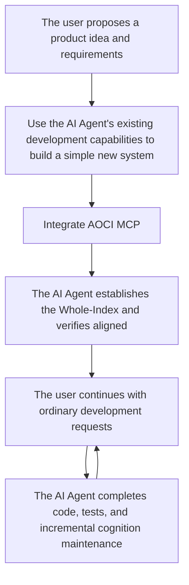
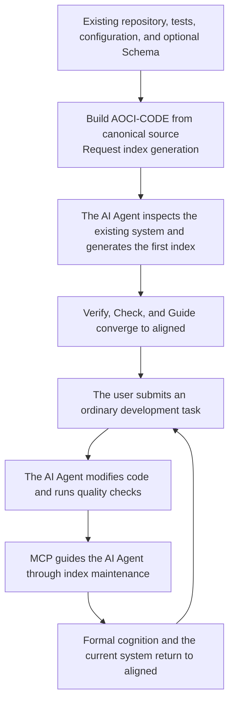

# AOCI-CODE

**AOCI-CODE is an indexing method that establishes global software-project cognition for AI Agents and provides a persistent, governable repository cognition map.**

🇺🇸 English | [🇨🇳 简体中文](README.zh-CN.md)


> [!IMPORTANT]
> AOCI-CODE v0.1.0-rc5 is the current release candidate. It is Fair Source/source-available software under FSL-1.1-MIT; see [LICENSE](LICENSE). Build from canonical source or use a signed package from the [v0.1.0-rc5 GitHub Release](https://github.com/aoci-spec/aoci-code/releases/tag/v0.1.0-rc5) after following the [release verification procedure](https://github.com/aoci-spec/aoci-code/blob/v0.1.0-rc5/docs/install.md#signed-github-release-packages).

## 🧠 What is AOCI?

**AOCI (AI-Oriented Cognition Infrastructure) is cognition infrastructure positioned between AI Agents and software systems.**

Large models handle reasoning, Agents handle planning and execution, and AOCI organizes code, configuration, tests, and database structures into continuously maintainable system cognition bound to the current system version, for Agents to read and understand before acting.

## 🗺️ What is AOCI-CODE?

AOCI-CODE originates from AOCI. Put simply, AOCI-CODE distills the information from source code, database structures, and other assets that materially affects how AI understands and modifies a system into a high-information-density, plain-text index combining symbols and semantics.

AOCI-CODE applies this method to projects through the `aoci` CLI and MCP Server.

When model context is limited, an AI Agent can read the index first, acquire most of the project’s key information in one pass, and then enter a specific development task. This reduces repeated searching and code re-learning while improving continuity across tasks and sessions.

- **The index is not a one-time summary**: it evolves with the system and remains in the project over the long term, where it can be diffed, reviewed, versioned, and rolled back with Git.
- **It records more than “where files are”**: AOCI-CODE also preserves object responsibilities, strong relationships, public contracts, transaction boundaries, compatibility constraints, and other information that is difficult to infer directly from code structure.
- **The index is portable**: the index is stored with the project and is not tied to a specific model, AI Agent, or individual session. When the index is aligned with the code version, different AI Agents and later sessions can read and reuse the same system cognition without rebuilding their understanding from scratch each time.
- **Code and databases can be understood together**: the model can build an independent table-level index for database tables. When Code Cognition and Database Cognition are delivered together, an AI Agent can understand the software system more completely.


Names in this document have the following roles: **AOCI** refers to the cognition paradigm and protocol, while **AOCI-CODE** refers to the project and the index itself that embody this method.

## ⚙️ How AOCI works

In the current Volume-first layout, AOCI-CODE organizes the index as governed, plain-text cognition assets stored with the project:

- **Root (`aoci.txt`)**: declares the composition and activation entry point of the current CognitionSet;
- **Meta (`aoci.meta.txt`)**: stores the tag dictionary, FRAS rules, and model-authoring constraints;
- **Code (`aoci.code.txt`)**: stores model-authored cognition for code and other repository assets;
- **Database (`aoci.database.txt`)**: stores optional table-level cognition when Database Cognition is enabled.

Root, Meta, and participating object Volumes together form the current Whole-Index. On top of these assets, the workflow has three stages:

1. **Establish governed cognition**: The model reads source code and accepted evidence, while AOCI-CODE governs Managed Scope and model-authored cognition for managed objects with the `index` role.
2. **Deliver cognition before action**: The Agent reads the Rules, live Guide, and current Whole-Index, then checks source and other evidence for the task at hand.
3. **Maintain cognition after verified change**: Once code and tests are stable, project Rules and the AOCI MCP workflow guide the Agent to update affected Entries and return formal cognition to `aligned`.

These plain-text cognition assets are stored with the project and can be versioned with Git. When cognition remains aligned with the current system version, different AI Agents and later sessions can read and reuse the same Whole-Index.

## 🚀 One-step setup

Give the following instruction to your AI Agent to download AOCI-CODE and integrate it; after restarting the Agent, send the second instruction to build the index:

```text
AOCI-CODE project: https://github.com/aoci-spec/aoci-code

Download the latest release package for this operating system and CPU architecture from
https://github.com/aoci-spec/aoci-code/releases, and follow the installation instructions
on the Release page to verify it. If no compatible release package exists, or if I
explicitly request the latest source, build it from the official repository.

After extracting the package, place aoci (aoci.exe on Windows) at a stable absolute path.
Then use that absolute path to do the following for my project:

1. Run init to initialize AOCI and integrate MCP for the current host; if this host does
   not write project configuration (Cursor, for example), give me the configuration I
   need to paste myself
2. Run scan

   scan takes its file inventory from Git, so do not add the cognition assets
   init writes (aoci.txt, aoci.meta.txt, aoci.code.txt, AGENTS.md) to .gitignore
   or .git/info/exclude — an ignored asset is silently skipped and the index
   cannot be built. Leave the host-config ignore init writes for itself as it is.

3. Tell me to restart the Agent so the newly written MCP server takes effect

Stop after those three steps and do not build the index yet — I will tell you to continue
after the restart.
```

After restarting the Agent, send this one:

```text
First confirm the AOCI MCP server is connected, then build the AOCI index for this project.
```

The index is authored through AOCI's MCP tools, and the MCP server that `init` has just written was not loaded in the session that wrote it, so index building has to follow the restart. A host that loads MCP servers dynamically may not need one; “Host integration” explains how to tell.

## 🔌 Manual integration

Obtain AOCI-CODE from canonical source or use a signed package from GitHub Releases. Before using a prebuilt binary, follow the basic, recommended, or full verification level in the [installation guide](https://github.com/aoci-spec/aoci-code/blob/v0.1.0-rc5/docs/install.md#signed-github-release-packages), and report which level completed. Give this README and the verified binary's stable absolute path to a trusted AI Agent such as Codex, Claude Code, Cursor, or OpenCode. The AI Agent can follow the in-project instructions to initialize AOCI, integrate MCP, and build the first index.

The time required to generate complete cognition for the first time depends on repository size. A normal integration consists of preparing the binary, having the AI Agent or user initialize the target repository, asking the host to “build the index,” and verifying alignment. Subsequent development does not require a repeated “maintain the index” reminder at the end of every request; project rules and the AOCI MCP workflow guide the AI Agent through incremental cognition maintenance after managed objects change.

### 0. 🧰 Requirements

- A verified release package or a checkout of the canonical AOCI-CODE source repository;
- For source builds only, the Go toolchain declared by `go.mod`, `make`, and the other tools required by the repository;
- A supported MCP host, such as Codex, Claude Code, Cursor, or OpenCode;
- Normal read and write access to the target repository.

The signed-package route and executable verification commands are in the [installation guide](https://github.com/aoci-spec/aoci-code/blob/v0.1.0-rc5/docs/install.md#signed-github-release-packages). The source-build route remains available below.

### 1. 📦 Current RC: use a verified package or build from source

The signed Release binary identifies itself as `aoci version 0.1.0-rc5`. A
source build identifies the exact checkout instead and may report a development
version such as `v0.1.0-rc5-1-g<short-commit>` (plus `-dirty` when applicable),
together with its Git commit. These identify different build inputs and are not
a version conflict.

To download with GitHub CLI, authenticate first, then download the tagged
Release assets:

```bash
gh auth login
gh release download v0.1.0-rc5 --repo aoci-spec/aoci-code
```

For an anonymous download, use the
[v0.1.0-rc5 Release page](https://github.com/aoci-spec/aoci-code/releases/tag/v0.1.0-rc5)
in a browser and download the required archive and verification assets there.

Clone the canonical repository, build the binary, and keep its resulting path stable:

```bash
git clone https://github.com/aoci-spec/aoci-code.git
cd aoci-code
mkdir -p build
make build
./build/aoci --version
```

On Windows, build the same canonical source in PowerShell:

```powershell
git clone https://github.com/aoci-spec/aoci-code.git
Set-Location .\aoci-code
New-Item -ItemType Directory -Force .\build | Out-Null
make build
Copy-Item .\build\aoci .\build\aoci.exe -Force
.\build\aoci.exe --version
```

Then provide this README to an AI Agent that you already trust for the project and ask:

```text
Read this AOCI-CODE README and use the built aoci binary at its stable absolute path
to initialize AOCI for the current project, integrate MCP, and run scan. Stop there and
tell me to restart the Agent; I will ask you to build the index afterwards.
```

The AI Agent should identify the current project root, use a stable absolute path to the built binary, perform the initialization appropriate for the current host, and clearly tell the user when a host restart or genuine human approval is required. The build output may remain in the AOCI-CODE source checkout or be placed in a shared stable tools directory, provided that the MCP configuration references the correct absolute path.

### 2. ⚙️ Manual initialization path

To initialize AOCI yourself first, run the following from the target repository root, or pass an explicit path through `--repo`:

```bash
AOCI=/absolute/path/to/aoci-code/build/aoci
"$AOCI" --repo . init --locale en-US --agent codex
"$AOCI" --repo . scan
```

`init` writes the Locale configuration, the managed `AGENTS.md` rules block, Git boundaries, and a minimal cognition skeleton with no semantics. Configuration and prompting vary by host; see “Host Integration” for details. It does not fabricate business semantics from filenames, directories, or an AST.

An existing project can switch its unified UI and future Entry-authoring language with `aoci config set locale zh-CN` or `aoci config set locale en-US`. The command immediately aligns the formal `#Locale` marker; existing ordinary Entries are not bulk-translated, and only Entries later created or genuinely updated use the configured Locale. Restart the host's AOCI MCP process after the change.

For a new repository, the first `scan` establishes the Managed Baseline. For a project that already has a governed Baseline, adding, removing, or changing managed scope should go through the formal Scope Change workflow rather than treating `scan --force` as a shortcut for redefining governance facts. `--force` also cannot erase unresolved drift, Receipt, or Recovery boundaries.

<details>
<summary>Windows PowerShell</summary>

```powershell
$Aoci = (Resolve-Path "C:\path\to\aoci-code\build\aoci.exe").Path
& $Aoci --repo . init --locale en-US --agent codex
& $Aoci --repo . scan
```

Confirm that `$Aoci` points to a stable absolute path.

</details>

### 3. 🤖 Have the AI Agent establish cognition for the first time (important)

Once initialization and `scan` are done, check whether the Agent session already exposes the AOCI tools; refresh or restart it if not. Then enter the following in the AI Agent for the target project:

```text
First confirm the AOCI MCP server is connected, then build the AOCI index for this project.
```

The host should read the project’s AOCI Rules and live Guide, inspect source code, tests, configuration, and relevant evidence, and then author FRAS candidates for managed objects whose role is `index`. Regular users do not need to orchestrate Plan, Stage, Check, Diff, CAS, or Apply manually.

Once the initial index is complete, users can submit ordinary development requests as usual, for example:

```text
Add priorities to tasks, including the frontend, backend, database, and test changes.
```

Users do not need to append “maintain the AOCI index at the end.” Project rules and MCP make the AI Agent check cognition changes after development is complete and code and tests are stable, then maintain affected Entries through the formal workflow. When the project uses `automation.mode=auto`, AOCI-CODE should interrupt the user only when genuine human approval is required, an external action must be performed, Recovery cannot be proven, a safety check fails, or a third-party concurrency conflict is found. Other automation modes follow their respective runtime contracts.

### 4. ✅ Verify alignment

After onboarding completes, run:

```bash
"$AOCI" --repo . verify
"$AOCI" --repo . check
```

The expected result is for formal cognition and the current managed source code to converge back to `aligned`. If they do not, consult the live Guide first; do not duplicate the internal state machine in a wrapper script:

```bash
"$AOCI" --repo . index agent guide --agent codex --json
```

### 5. 🩺 Run basic diagnostics

```bash
"$AOCI" --repo . capabilities
"$AOCI" --repo . doctor
```

To confirm which AOCI the host is actually connected to, read what the server reports about itself rather than what is on disk: in any `aoci_overview` `check_only` response or any `aoci_maintain` response, `cognition_receipt.mcp_service_version` is the running version and `runtime_repository_root` is the repository it governs. The matching binary path is the `command` in the project's `.mcp.json` or the equivalent host configuration — `.codex/config.toml`, `opencode.json`, or `.cursor/mcp.json`. Replacing bytes on disk does not change a running MCP process, so recheck against those facts after an upgrade or a rollback.

For a one-off walkthrough, use `examples/minimal-repository` in the repository.

<details>
<summary>Developers: build the AOCI-CODE CLI from source</summary>

If you are developing AOCI-CODE itself, run the fast quality gate during ordinary development and before a commit:

```bash
make fast
```

Run the following when you need Full Confidence verification and an executable:

```bash
make full
./build/aoci --version
```

`make full` is the Full Confidence gate and already includes `make build`. `make check` is only a compatibility alias and enters the same full gate, so it need not be repeated mechanically alongside `make full`. Use `make release-check` for stable-release rehearsals. If you only need a direct build, run:

```bash
mkdir -p build
CGO_ENABLED=0 go build -o build/aoci ./cmd/aoci
```

The AOCI-CODE CLI is a CGO-free, single-binary Go program. The current `make build` target writes `build/aoci`; the PowerShell example copies that Windows PE output to the conventional `build/aoci.exe` name. Before a release or delivery, rely on the actual binary's `--version` and `capabilities` output and on the formal Release Manifest rather than only on a version string in the README.

</details>

## 📁 What appears after initialization?

A typical Volume-first repository contains these formal cognition assets:

```text
aoci.txt                    Root: declares the current CognitionSet and participating Volumes
aoci.meta.txt               Meta: tag dictionary, FRAS rules, and authoring constraints
aoci.code.txt               Code: model-authored cognition for code and repository assets
aoci.database.txt           Database: optional table-level cognition; absent by default
.aoci/
├── config.json             Team policy, Locale, Scope, and budgets
├── baseline.json           Governed Baseline for source, cognition, and database bindings
├── curation.json           Optional file-level include/exclude decisions
└── ...                     Drafts, Ledger, transactions, and recovery evidence; normally not committed to Git
```

Initializing a new project creates the Volume Root, Meta, and an empty Code Volume; Database is absent by default. AOCI-CODE does not automatically generate repository business semantics or Database semantics.

`aoci init --agent <name>` additionally writes host integration configuration
(`.mcp.json`, `.claude/settings.json`, `.codex/config.toml`, or `opencode.json`)
whose command and repository paths are machine-bound absolute paths. Add those
files to the repository's `.gitignore` and do not commit them: a committed copy
breaks on every other machine, and because the installers detect an existing
entry by key presence, re-running `init` there silently keeps the broken paths.


## 🔄 How a complete development task runs

The following two diagrams describe the workflow users actually experience; they do not explain AOCI’s internal implementation.

### 🆕 New project: build a simple system first, then integrate AOCI for continuous evolution



*A new system does not need AOCI-CODE installed from the first line of code. Users can first use the AI Agent's existing development capabilities to complete a product prototype; a recommended scale is roughly 10,000–30,000 lines (not a hard threshold). Teams that want cross-session cognition from an earlier stage of the project may integrate it sooner.*

### ♻️ Existing project: index the current repository, then iterate continuously



*After the first index is complete, both flows enter the same day-to-day mode: the user describes only the business or engineering requirement; the AI Agent combines the Whole-Index with current evidence, completes development and verification, and maintains changed objects through MCP during task closing. Users do not need to learn internal Plan, Stage, Diff, CAS, or Baseline commands, nor repeat the maintenance requirement in every Prompt.*

If a complete batch is rejected before any formal write begins, the AOCI index remains unchanged. If the workflow is interrupted after formal writes begin, the system preserves the immutable Intent, write evidence, and Recovery state, then either Resumes from a provable postimage or rolls back to the exact preimage. A third-party byte conflict fails closed instead of overwriting an external modification by “finishing the write.”

The final state explicitly returns `applied`, `repair_required`, or `stopped`. `stopped` is not success and does not necessarily mean that no write occurred; inspect `failed_step`, formal-write evidence, and the recovery action returned by Guide.

## 🤝 How the model and AOCI-CODE divide responsibilities

### 🧠 The model owns semantics

The host model reads source code, tests, configuration, documentation, and necessary evidence, then determines:

- what an object is actually responsible for;
- which files, modules, or database objects are strong relationships that must be considered when making safe changes;
- which APIs, commands, formats, or observable contracts it exposes;
- which transaction, authorization, concurrency, caching, deployment, compatibility, or historical constraints cannot be inferred from ordinary structure alone.

AOCI-CODE does not assemble FRAS automatically from filenames, paths, extensions, ASTs, or templates, and it does not silently rewrite model-authored semantics.

### 🛡️ AOCI-CODE owns governance

AOCI-CODE is responsible for:

1. establishing Safe Inventory, Managed Scope, and the current Baseline;
2. delivering and confirming the identity of the current Whole-Index;
3. generating a deterministic Plan, target set, and source SHA-256 values;
4. validating candidate structure, the tag dictionary, relationship identities, Scope, Ownership, budgets, and affected range;
5. preserving the binding among Check, Diff, and review content;
6. committing a complete batch with cross-process locks, CAS, and AtomicWrite;
7. advancing the Baseline, appending the Ledger, and preserving recovery evidence after a post-write failure;
8. proving the current governance state again through Verify, Check, and Guide;
9. deriving Lineage, Relations, Impact, Snapshot, and Evolution observations from authoritative assets without creating a second source of truth.

All-green machine results mean only that the encoded structural and governance contracts hold; **they do not mean that every model-authored semantic statement is absolutely correct**.

## 🗂️ How is an AOCI index organized?

Conceptually, an AOCI index has two layers: “index rules” and “index Entries.” The current product supports two physical layouts, and they must not be treated as a single file format:


### 🧱 Volumes v1 layout

A Volume-first project separates responsibilities:

- `aoci.txt` serves only as the Root and declares the Volumes participating in the current CognitionSet;
- `aoci.meta.txt` stores Meta, the tag dictionary, FRAS rules, budgets, and the authoring contract;
- `aoci.code.txt` stores Code-object Entries;
- `aoci.database.txt` stores database-object Entries when Database Cognition is enabled.

Code and Database Volumes reuse the same FRAS lexical structure, but they have independent object identities, Evidence bindings, ownership, and lifecycles. Root, Meta, and object Volumes together form the Whole-Index; reading only the `aoci.txt` Root is not sufficient to claim that the complete system cognition has been read.

Think of it as a map:

- Index rules are the map’s **legend and coordinate system**;
- Index Entries are the **specific markers** that describe each location on the map;
- Root is the **catalog and version entry point** for the current map set;
- A Volume is a **separate volume** governed by the same protocol but with a different evidence source and lifecycle.

### 🧾 What the index header looks like

Root and Meta each open with machine-read header lines. This is what `aoci init` writes for a new `en-US` project named `my-service`, starting with the Root, which is the activation entry point:

```text
#AOCI-ROOT-MANIFEST: 1
#Format-Version: cognition-volumes/v1
#Locale: en-US
#Project: my-service
#Global-Invariants: -
#Volume: id=meta kind=meta path=aoci.meta.txt format=meta-v1 depends=- state=enabled
#Volume: id=code kind=code path=aoci.code.txt format=object-fras-v2 depends=meta state=enabled
```

Each `#Volume:` line declares one participating Volume with its identity, kind, path, format, dependency, and activation state. A Volume that is not declared here is not part of the current CognitionSet, whatever else the working tree happens to contain. Enabling Database Cognition adds one more line, `#Volume: id=database kind=database path=aoci.database.txt format=table-fras-v2 depends=meta state=enabled`.

Meta then opens with the rules that govern every Entry:

```text
#AOCI-META-VOLUME: 1
#Object-Protocol: repository-cognition-object/v2
#FRAS-Discipline: 2
#FRAS-v2-Limits-Authority: machine-contract
#S-Admission: non-inferable-and-error-preventing
#S quota: C9-8≤600 C7-4≤500 C3-1≤50
#Object-Kinds: code=file database=table
```

`#FRAS-v2-Limits-Authority: machine-contract` is the load-bearing line: the field limits belong to the binary, not to this text, so a project cannot widen them by editing its own Meta. `#S-Admission` and `#S quota` govern the S field specifically — what may be recorded there at all, and how many characters each importance band may spend. The tag dictionary follows immediately after these lines; it is shown in full further below.

The Code Volume opens with a single line, `#AOCI-CODE-VOLUME: 1`, and everything after it is directory sections and Entries.

These are the values a new project starts from, not fixed protocol constants. Each repository's own Root and Meta are authoritative afterwards: an older project may carry a custom tag dictionary, and a project initialized with `--locale zh-CN` writes `#Locale: zh-CN` and localizes the `#S quota:` key accordingly.

### 📐 What do the index rules define?

| Rule | Purpose |
| --- | --- |
| **Tag dictionary** | Uses compact tags to represent an object’s architectural layer, functional domain, importance, technical characteristics, and size |
| **FRAS fields** | Defines how each Entry records object responsibility, strong relationships, public interfaces, and key constraints |
| **Relationship rules** | Defines how relationships between objects are referenced, avoiding ambiguous or unverifiable descriptions |
| **Scope and ownership** | Defines which objects enter cognition with the `index` role and which Cognition Volume owns each object |
| **Length and budgets** | Controls information density so source code or an ordinary summary is not copied directly into the index |
| **Validation rules** | Defines the structural and governance conditions a candidate Entry must satisfy before entering the formal index |

In Volumes v1, the project’s Meta Volume stores these rules; in the Legacy layout, they live in the monolithic Header. Different projects may use different tag dictionaries, while the basic semantic structure of FRAS remains consistent.

The README only explains how to read these rules. For concrete, executable rules, defer to the current project’s Meta or Legacy Header, AOCI Guide, and formal specification.

## 🧾 What does one index Entry record? (FRAS)

After the rules are established, the model writes one index Entry for every managed object with the `index` role. The `observe` role participates only in change observation, while the `exclude` role creates explicit negative space; neither owns a formal Entry. AOCI uses **FRAS** to organize the four most important categories of semantics in an Entry:

- **F — Function**: what the object is responsible for;
- **R — Relations**: which other objects must also be considered to understand or modify it safely;
- **A — API**: which interfaces, commands, formats, or observable contracts it exposes;
- **S — Non-obvious constraints**: important information not yet expressed by F, R, or A but needed to understand or modify the object safely, such as key constraints, exceptions, boundaries, and special semantics. S should not repeat the first three fields.

For example, inside the `===.../internal/fs/===` directory section, an Entry uses the basename:

```text
atomic.go[CG9L]: F:Provides durable replace CAS, create CAS, atomic writes, and no-clobber recovery moves | R:code:internal/fs/atomic_exchange_linux.go,code:internal/fs/atomic_exchange_windows.go,code:internal/fs/lock.go | A:AtomicWrite,AtomicWriteCAS,AtomicCreateCAS,AtomicMoveCAS | S:Native publication never degrades to an overwriting rename; on a race, unsafe type, or unverifiable bytes, preserve third-party state and fail closed
```

The directory section and basename resolve to a Code object identity. For cross-Volume or system projections, it can be expanded into a canonical identity such as `code:internal/fs/atomic.go`. A Database object uses its own canonical identity, such as `database://primary/public/orders`.

This Entry can be understood as two parts:

```text
atomic.go [CG9L]
└─ object ─┘ └ tags ┘

F: Core responsibility
R: Strong relationships that must be understood together
A: External interface or contract
S: Important additional information beyond F, R, and A
```

| Field | Question answered | Example content |
| --- | --- | --- |
| **F — Function** | What is this object’s core responsibility? | Provide durable replace CAS, create CAS, atomic writes, and no-clobber recovery moves |
| **R — Relations** | What must be inspected together when modifying it? | `atomic_exchange_linux.go`, `atomic_exchange_windows.go`, `lock.go` |
| **A — API** | What can external callers depend on? | `AtomicWrite`, `AtomicWriteCAS`, `AtomicCreateCAS`, `AtomicMoveCAS` |
| **S — Non-obvious constraints** | What important information beyond F, R, and A must be added? | Native publication must not degrade to an overwriting rename; preserve third-party state and fail closed on failure |

Compact tags give each object coordinates for architectural layer, functional domain, importance, optional technical characteristics, and size. The tag dictionary is defined by the project’s Meta Volume or Legacy Header. The program validates the dictionary and structure but does not decide business meaning.

**S is not a Synopsis, an ordinary summary, or a repetition of F, R, and A.** It supplements important information not covered by the first three fields that affects understanding or engineering correctness, for example:

- a Redis access failure must fall back to the database;
- a particular table must not enter AutoMigrate;
- a legacy compatibility branch must not be removed using ordinary cleanup logic;
- the original file must be preserved after a write failure.

The model authors these semantics from actual source code and evidence. AOCI-CODE validates Entry structure, binds the source file, and governs how the Entry enters the formal index.

### 🏷️ Reading the starter tag dictionary

The following excerpt is copied verbatim from the current `en-US` Volume Meta template (`textassets/en-US/templates/volume-meta.txt.tmpl`). It is a starter dictionary, not a universal vocabulary: each repository's formal Meta remains authoritative. The starter declares no D dictionary; D remains an optional axis and may be used only when the current formal Meta declares it.

<details>
<summary>Show the governed starter dictionary</summary>

```text
#Canonical-Tag-Authoring: compact A+B+C+[D]+E; dotted form is read compatibility only
#Code canonical identity example: code:path/to/file.go
#Code Entry example: file.go[EG7T]: F:Runs the example application | R:- | A:- | S:-
#[Tag dictionary: code]
#A Layer: C-SharedFoundation E-EntryBoundary A-ApplicationOrchestration D-DomainLogic K-AlgorithmComputation M-Middleware P-Persistence I-IntegrationAdapter R-RuntimeFoundation L-LibrarySDK F-DeclarativeConfiguration O-OperationsDelivery T-TestValidation S-DocumentationSpecification X-DevelopmentTooling Z-Other
#B Module: G-CrossDomain U-UserInteraction B-CoreBusiness D-DataState I-IdentityAccess N-NetworkProtocol M-MessageEvent S-SecurityPrivacy C-ConfigurationPolicy O-Observability R-ReliabilityRecovery P-PerformanceResource W-WorkflowScheduling A-AnalyticsIntelligence H-HardwareDevice L-Localization V-BuildRelease Q-QualityAssurance E-ExtensionPlugin Z-Other
#C Importance: 9-highest 8-very-high 7-high 6-above-average 5-medium 4-below-average 3-low 2-very-low 1-lowest
#E Scale: L-large>400 M-medium200-400 S-small100-200 T-tiny<100
#[Tag dictionary: database]
#A Layer: E-EntityMaster T-TransactionFact R-RelationMapping M-DetailDependent C-ReferenceDictionary S-StateStorage H-HistoryVersion L-LogAudit Q-QueueOutbox A-AggregateProjection K-KeyValueConfiguration B-DocumentLargeObject Z-Other
#B Module: G-CrossDomain B-CoreBusiness I-IdentityAccess T-OrganizationTenant U-UserExperience F-FinanceBilling K-ContentKnowledge C-ConfigurationPolicy W-WorkflowTask M-MessageEvent N-ExternalIntegration S-SecurityPrivacy O-ObservabilityAudit R-ReliabilityRecovery P-PerformanceResource A-AnalyticsIntelligence H-HardwareDevice L-Localization V-BuildRelease Q-QualityTesting E-ExtensionPlugin Z-Other
#C Importance: 9-highest 8-very-high 7-high 6-above-average 5-medium 4-below-average 3-low 2-very-low 1-lowest
#E Scale: L-large>400 M-medium200-400 S-small100-200 T-tiny<100
```

</details>

Under the starter Code dictionary, `[CG9L]` means `C` SharedFoundation, `G` CrossDomain, `9` highest importance, and `L` large scale; no D value is present. This explains how to read the existing Entry, not how the model should assign tags. The model must still choose tags from the current project Meta based on source and accepted evidence.

## 📚 Cognition Volumes

AOCI-CODE maintains one logical Whole-Index, while different cognition types have independent indexes, ownership, and lifecycles.

| Volume | Responsibility |
| --- | --- |
| **Root** | Declares the composition, dependencies, and activation entry point of the current CognitionSet; published last so partial assets cannot be mistaken for the complete set |
| **Meta** | Stores the tag dictionary, FRAS rules, quotas, and the model-authoring contract |
| **Code** | Stores repository cognition objects for code, tests, configuration, documentation, and operations assets |
| **Database** | Stores optional table-level cognition objects and binds them to accepted Schema Evidence |

Each object has exactly one valid Owner. Placing an object in the wrong Volume creates an Ownership Conflict. AOCI-CODE repairs it only when the machine can prove the incorrect Owner, the correct Owner, and the current object facts; it does not guess ownership from name similarity.

Code Volume, Database Volume, and Scope can evolve together, but they share one governed commit boundary. Applying a single Domain must not discard another Domain’s existing Baseline projection. Volume Apply, Baseline updates, and related Scope projections must be published as one consistent Cognition Transaction result or enter provable Recovery, rather than leaving a half-complete state in which “the file succeeded but another Volume has no baseline.”

## 🔌 Host integration

`aoci init` always writes managed AI Agent rules, but host integration behavior differs: Codex writes project-level MCP configuration and can optionally install a context-compaction prompt plus `SessionStart(compact)` with `--hooks`; it still installs no file-edit Hook. Claude Code can install a `PreToolUse` Hook; OpenCode V1 receives a strict project-level `opencode.json`; Cursor only returns a reference configuration snippet and does not write project configuration. After configuration, check whether the current host session already exposes AOCI tools. Refresh or reopen that project session only if it has not loaded the new server. A new session normally reads Rules and the Whole-Index once. As long as cognition identity remains valid and no known Host compaction occurred, later tasks reuse current cognition instead of mechanically injecting the entire index again.

| Host | Current integration | Boundary |
| --- | --- | --- |
| **Codex** | Project-level stdio MCP; optional `--hooks` compaction prompt and `SessionStart(compact)` | Requires review and trust through Codex `/hooks`; installs no file-edit Hook |
| **Claude Code** | Project-level MCP; optional thin `PreToolUse` guard | The Hook only provides a pre-write reminder or Stale guard; it is not the AI Agent runtime |
| **OpenCode V1** | Strict project-root `opencode.json` via `--agent opencode` | Continue immediately if tools are loaded; otherwise refresh or reopen the project session |
| **Cursor** | Returns an MCP reference configuration snippet | Does not write project configuration; integration must still be completed manually for the host |
| **Other MCP hosts** | Connect to the standard stdio Server | Require manual configuration and host-specific validation |

```bash
aoci --repo /absolute/path/to/repository init --agent codex
aoci --repo /absolute/path/to/repository init --agent codex --hooks
aoci --repo /absolute/path/to/repository init --agent claude --hooks
aoci --repo /absolute/path/to/repository init --agent opencode
aoci --repo /absolute/path/to/repository init --agent cursor
```

Codex `--hooks` limits a compaction handoff to receipt identity, unfinished
write or Recovery state, and an immediate reload instruction; it must not retain
or summarize Whole-Index or Overview/Attestation bodies. A `PreCompact` hook
cannot inject into, or delete history from, the Host compaction input, so it
cannot enforce this alone. Review and trust the installed project hook through
Codex `/hooks` before relying on it.

Legacy output retains Levels 0–4 for compatibility with existing hosts and reports. The current `cognition-state/v2` expresses “model cognition usability” as Levels 0–3 and separates strict proof and governance facts into independent dimensions:

| State | Meaning |
| --- | --- |
| `delivery_verified` | The current Index is loaded and Host delivery is confirmed; the strict Challenge may still be incomplete |
| `model_cognition_usable` | The model has system-framework cognition usable for the task |
| `strict_attestation_verified` | The current Index identity, Entry sequence, count, and Challenge have all passed strictly |
| `governance_aligned` | Formal cognition, Baseline, and governance state are currently aligned |
| `current_system_cognition_reliable` | Current complete-system cognition can be used without qualification as the current system-level prior |

These dimensions do not substitute for one another. Attestation proves only delivery coverage and identity consistency for the current material; it does not mean the AI Agent has fully understood every possible future task. Only `current_system_cognition_reliable=true` permits an unqualified claim of complete current-system cognition.

## ⌨️ Common CLI commands

| Command | Purpose |
| --- | --- |
| `aoci init` | Installs the repository contract and initial Volumes layout without business semantics |
| `aoci scan` | Establishes the Baseline for first-time integration; scope changes under an existing Managed Baseline enter Scope Change |
| `aoci status --deep` | Legacy-only deep status; not the Cognition Volumes maintenance route |
| `aoci verify` | Reports Missing, Orphan, Stale, and Unbaselined facts |
| `aoci check` | Runs the aggregated governance gate |
| `aoci index agent guide` | Enters the deterministic host-agent workflow |
| `aoci capabilities` | Shows capabilities provided by the current binary |
| `aoci doctor` | Diagnoses repository and host integration |
| `aoci database` | Explicitly configures and validates PostgreSQL/MySQL/openGauss Schema Evidence |
| `aoci database source access` | Read-only check of whether a database credential reference has been provided by the external environment; does not return the credential value |
| `aoci database cognition bootstrap` | Adds Database Cognition to an aligned Code-only Volumes project |
| `aoci cognition plan` | Read-only Bootstrap or Legacy migration planning and complete target Code Volume comparison |
| `aoci cognition plan diff --target-index <file>` | Compares the active Code Volume with a separately stored complete target Code Volume; the target is non-authoritative and cannot be applied directly |
| `aoci cognition bootstrap` | Governs only an uninitialized repository or the exact zero-Entry Legacy minimal skeleton that an older `init` wrote; it never targets an initialized Volumes v1 repository — a Volumes skeleton with zero Entries is built through `aoci scan`, then Guide and no-argument `aoci_maintain` — and a mature Legacy project should use Migration |
| `aoci cognition migration` | Governs Legacy migration snapshots, mapping, approval, application, recovery, or rollback |
| `aoci cognition system lineage` | Derives the origin and binding chain of important cognition objects |
| `aoci cognition system relations` | Derives the narrow relation projection: Volume containment and dependencies plus resolved model-authored R relationships |
| `aoci cognition system impact` | Queries Code Cognition objects potentially reached by a database change along explicit formal R relationships |
| `aoci cognition system snapshot` | Outputs a read-only snapshot projection of the current CognitionSet |
| `aoci cognition system evolution` | Compares a historical Snapshot supplied by the caller with the current projection |
| `aoci mcp` | Starts the stdio MCP Server |

A mature Legacy index upgrades through `aoci cognition onboard start`, which
preserves the existing model-authored mapping and human digest-approval
boundary. Once Apply reaches an aligned Code-bearing Volumes v1 layout,
`aoci_rules` can use `module_path` immediately; there is no additional module
index format, and a target Code Volume comparison is not an Apply or migration
path.

Common combinations:

```bash
# Initialization and first Baseline
aoci --repo . init --locale en-US --agent codex
aoci --repo . scan

# Verification and governance gates for Cognition Volumes
aoci --repo . verify --json
aoci --repo . check --json

# Live Guide; do not duplicate the state machine in a wrapper
aoci --repo . index agent guide --agent codex --json

# Capabilities and diagnostics
aoci --repo . capabilities
aoci --repo . doctor

# Database Evidence, Access, and Cognition lifecycle
aoci --repo . database --help
aoci --repo . database source access --source primary --json
aoci --repo . database cognition status
aoci --repo . cognition onboard start --json
aoci --repo . cognition plan --help
aoci --repo . cognition plan diff --target-index /path/to/target.aoci.code.txt --json

# Derived System Cognition observations
aoci --repo . cognition system lineage
aoci --repo . cognition system relations

# MCP stdio Server
aoci --repo . mcp
```

Plan, Stage, Check, Diff, Apply, Curation, Scope Change, Bootstrap, Migration, and recovery commands still exist. Regular users should follow the Guide returned by the running binary rather than copying the internal state machine into scripts.

### 🔒 About “read-only” commands

For verify, check, index score, and index inventory, “read-only” means that the formal index and Baseline are not modified; it does not mean strictly zero filesystem writes. When Ledger is enabled, all four commands may append to the local Ledger, and verify also attempts to write Verify History. An audit-write failure does not change existing exit codes or governance criteria.

If a strict zero-file-write operation is required, use an isolated copy; the current public CLI does not expose a blanket switch that disables every Ledger and Verify History write. System Cognition commands do not create a second formal state, but ordinary CLI calls still follow the current version’s runtime contract for Ledger and local history records.

## 🧩 MCP Server

`aoci mcp` does not require a resident Daemon and exposes exactly nine tools over stdio:

| Category | Tools |
| --- | --- |
| **Cognition reads** | `aoci_rules`, `aoci_overview`, `aoci_get_entries`, `aoci_search` |
| **Cognition maintenance** | `aoci_maintain`, `aoci_update_entry`, `aoci_remove_entry` |
| **Supporting evidence** | `aoci_header`, `aoci_report` |

In MCP mode, stdout is reserved for JSON-RPC, while logs and diagnostics go to stderr. Tool Descriptions, JSON Schemas, and machine-state values provided by the running binary are authoritative; the README is only an entry point for use.

The current AOCI-CODE release provides the System Cognition capabilities through the existing CLI and governance kernel. They do not add a tenth MCP tool or change the names, purposes, or stdio contract of the existing nine tools.

## ⏳ Long-running sessions and Whole-Index delivery

At the beginning of a new conversation, an AI Agent normally loads one complete Overview to establish system cognition matching the current repository, Index version, and AOCI service identity. As long as the model can still use that cognition reliably, it need not reload mechanically before every task or tool call.

During the same conversation, the model decides whether to load again based on its own cognition state, except after a known Host context compaction. A compacted handoff may preserve only receipt identity, unfinished write or Recovery state, and an immediate reload instruction; it must not retain or summarize Whole-Index or Overview Header, Entry, Chunk, Challenge, or Attestation bodies. Index semantics or a receipt copied into that handoff cannot prove current model cognition reliable.

Before continuing business work after known compaction, the Agent reloads Rules if they are no longer reliably present, declares `context_compaction` with a fresh event ID, and completes one ordinary full Overview cursor, confirmation, and Attestation sequence. `check_only` and the cognition probe are not substitutes. After fresh complete transport, the existing partial or failed Attestation rule still permits source-bound continuation without a second automatic Overview. For semantic change or a major phase boundary without known compaction, AOCI provides refresh thresholds, Checkpoints, and identity facts while the model decides whether system-level cognition must be restored for the task.

The body of each complete Overview consists of a start marker, the exact content of the current formal index, and an end marker.

When an Overview exceeds the project’s Chunk budget:

1. delivery begins immediately with Chunk 1;
2. the AI Agent must follow `next_cursor` automatically through the final Chunk;
3. the AI Agent submits one Attestation using the delivered Whole-Index;
4. local search, old memory, supplemental source reading, or direct file reads must not be presented as complete delivery;
5. Pending Recovery or an inconsistent snapshot fails closed without mixing content.

`overview_delivery.chunk_tokens` is the only delivery-size setting. Its default is `8000`, with a valid range from `4000` to `24000`. `check_only=true` is a compact checkpoint without a Chunk chain.

The cognition refresh threshold defaults to 30 distinct semantic paths and can also be configured per project. For exact counting rules, defer to the Cognition Refresh documentation and runtime contract.

## 🗄️ Database Cognition

AOCI-CODE can bring database structure into the same cognition and evolution governance, but the access boundary is explicit and narrow:

```text
Explicit database command
  → Read-only PostgreSQL/MySQL/openGauss system catalogs
  → Canonical Schema Evidence
  → Human acceptance of the Evidence Hash
  → The host model authors table-level FRAS from complete evidence
  → Cognition is bound to Evidence and enters governed Apply
```

- No database network access occurs when no database is configured or no explicit database command is run;
- Only Schema metadata for base tables is read, not business rows; views, routines, and comments are outside the current collection scope;
- No DDL or DML is executed;
- Hostnames, usernames, DSNs, and credential values are not written into cognition assets;
- Database Cognition Apply runs offline and does not reconnect to the database while writing;
- The program preserves and compares structural Evidence, but the model still authors table responsibilities, relationships, and high-value constraints.

The initial openGauss profile is deliberately limited to openGauss 6.0.5 LTS
in A/PG compatibility mode and ordinary non-partitioned base tables. Unsupported
catalog features fail closed instead of being silently reduced to PostgreSQL
facts; this does not claim support for MogDB, GaussDB, Dolphin/B/MySQL mode,
partitions or subpartitions, column-store, MOT, foreign or temporary tables,
views, routines, or triggers.

Here, fail-closed detection applies to selected visible table-like objects with
unsupported semantics. Routines and triggers remain outside the v1 table-object
domain and are never represented as table facts.

The openGauss path uses AOCI's reviewed local patch over the official Connector
v1.0.8 source. Its strict parser accepts only the reviewed connection
parameters and does not consume ambient `PG*`, service, password-file,
home-directory, or logger configuration. A TCP connection outside a numeric
loopback address must explicitly use `sslmode=verify-full` (and an absolute
trusted-root path in `sslrootcert` when supplied), with TLS 1.2 as the minimum;
TLS downgrade modes are rejected.
`sslmode=disable` is accepted only for an explicit Unix socket or numeric
loopback address used as a local/test boundary. Database administrators remain
responsible for supplying that DSN outside the conversation and provisioning
the least-privilege account.

The Database Volume may be absent by default. It enters the Whole-Index only after the project explicitly enables Database Cognition and completes Evidence, Binding, and lifecycle governance.

### 🔐 Database Access Onboarding: users do not need to understand DSN details

Regular users only need to declare a non-sensitive identity for a database Source. If `--credential-env` is omitted, AOCI derives a stable environment-variable reference from the Source ID; for example, `primary` maps to `AOCI_DB_PRIMARY_DSN`:

```bash
aoci --repo . database source add \
  --source-id primary \
  --engine postgresql \
  --database-name app \
  --namespace public
```

Then use the read-only Access Preflight to determine whether the reference has been provided by the external environment:

```bash
aoci --repo . database source access --source primary --json
```

This command does not connect to the database, return a credential value, or ask regular users to paste a DSN into a conversation. A database or infrastructure administrator should provide the corresponding environment variable outside the AOCI process and grant read-only, least-privilege access to system catalogs. Source configuration stores only the credential **reference name**, not the Secret.

The current release candidate provides only the Environment Credential Provider. Cloud Secret Managers such as Vault, Kubernetes Secret, and AWS/GCP/Azure may be integrated through the same Provider boundary in later versions, but they are not current capabilities and must not be implied as available in the README.

This division of responsibility keeps account formats, DSN encoding, and Secret lifecycle management away from regular users while preserving explicit authorization: AOCI does not discover credentials automatically, scan `.env`, read Secret files, or bypass a database administrator’s authorization boundary.

## 🌐 System Cognition Foundation

AOCI-CODE provides a set of **derived System Cognition observations** on top of Code Cognition and Database Cognition. They answer questions such as “where did this object come from?”, “which Code Cognition objects might a database change affect?”, and “what changed as cognition evolved from a historical observation to the present?”, but they do not establish a new layer of authoritative facts.

```bash
# Cognition-object origin and its Evidence and Receipt bindings
aoci --repo . cognition system lineage

# Volume containment and dependencies plus resolved model-authored R relationships
aoci --repo . cognition system relations

# Find code impact from a database object along formal R relationships
aoci --repo . cognition system impact \
  --object database://primary/public/orders

# Save a historical observation on the caller side
aoci --repo . cognition system snapshot --json > previous.json

# Compare a caller-supplied historical observation with the current derived projection
aoci --repo . cognition system evolution \
  --snapshot-file previous.json
```

### ⚖️ Authority boundary

| Capability | Data source | Persists new facts? | Key boundary |
| --- | --- | --- | --- |
| **Lineage** | Cognition, Evidence, Receipt, and Baseline bindings | No | Explains the origin chain; does not become an independent Provenance database |
| **Relations** | CognitionSet structure plus canonical R values model-authored in formal Entries | No | Projects Volume containment, Root dependencies, and resolved model-authored relationships accepted through governance |
| **Impact** | Current formal R relationships and resolvable object identities | No | Does not infer business semantics automatically from SQL, imports, paths, or names |
| **Snapshot** | Deterministic observation of current authoritative assets | No | Output is stored by the caller and is not a Baseline or Recovery asset |
| **Evolution** | Caller-supplied old Snapshot and current projection | No | Compares observations without advancing an independent lifecycle |

Every System Cognition result reports `derived=true`; the relation projection additionally reports `authoritative=false`. Cognition Volumes, Schema Evidence bindings, Baseline fingerprints, and receipt-bound identities remain the underlying authorities. Unresolved R relationships produce an incomplete result or diagnostics instead of being guessed and filled in by the program.

**AOCI-CODE is not a knowledge-graph system.** Narrow System Relation Projection can be understood as a convenient relationship view, but it does not own a second state-management system, an independent write path, or a new fact store. Derived output can be deleted and recomputed from current authoritative assets. If a projection conflicts with authoritative assets, the latter prevail.

## 🔒 Execution modes, privacy, and data boundaries

| Mode | Behavior |
| --- | --- |
| **Agent-native** | The current host model reads evidence and authors semantics; AOCI-CODE does not require a second model API |
| **Endpoint-native** | An optional user-configured OpenAI-compatible endpoint drafts candidates; the key remains in an environment variable |
| **Deterministic-only** | Disables AI while retaining scanning, Baseline, validation, queries, Scope, governance, CI, and recovery; new semantics still require a model or human author |

- AOCI-CODE itself is local-first by default, with no default cloud endpoint, hosted source-upload service, or required background Server.
- Data handling in Agent-native mode depends on the user-selected host and its product policies; AOCI-CODE does not upload the data on the host’s behalf.
- Database network access must be triggered explicitly and is restricted to read-only Schema metadata.
- Ledger, drafts, transactions, and recovery evidence are stored under `.aoci/` by default and are normally ignored by Git; formal cognition and team-governance assets may be committed to Git.
- System Cognition Projection is computed locally from existing authoritative assets and requires no graph database, vector database, or remote graph service.

## 🔍 Why not just a Repo Map or RAG?

Ordinary search, ASTs, LSP, code graphs, and RAG are good at answering structural or retrieval questions. AOCI-CODE’s distinct role is to maintain a versioned cognition asset that covers the managed scope and evolves incrementally with the software.

| Capability | What developers actually get |
| --- | --- |
| **Whole-Index Cognition** | A unified system map covering the current managed scope, rather than fragments assembled temporarily for each task |
| **FRAS Semantic Objects** | Responsibilities, strong relationships, public contracts, and high-value constraints for every object with the `index` role |
| **Cross-session Persistence** | Cognition assets are preserved with the repository so later sessions and other AI Agents can reuse the same version |
| **Managed Scope** | Explicitly identifies which objects enter formal cognition, which are observed only for change, and which form formal negative space |
| **Drift Detection** | Distinguishes Missing, Orphan, Stale, Unbaselined, line-ending changes, and curation differences |
| **Governed Updates** | Candidates enter formal assets through source binding, Plan, validation, Review, CAS, atomic writes, Baseline, and recovery workflows |
| **Delivery Attestation** | Uses Chunk, Cursor, Receipt, and Challenge to prove that the Whole-Index was delivered in full |
| **Database Cognition** | Establishes and governs table-level cognition from explicitly accepted PostgreSQL/MySQL/openGauss Schema Evidence |
| **System Intelligence Projection** | Derives Lineage, narrow Relations, database-to-code Impact, Snapshot, and Evolution observations from authoritative cognition and bindings without duplicating authoritative state; Impact traverses only explicit model-authored R relationships |

## 🔗 Relationship to other code-understanding methods

AOCI-CODE complements existing tools rather than replacing them.

| Method | Best at answering | AOCI-CODE’s distinct responsibility |
| --- | --- | --- |
| **RAG / search** | Where is the source text relevant to the current question? | Maintains versioned cognition covering managed scope before the query, including negative space and governance state |
| **AST / LSP / ctags** | Where are symbols, types, definitions, and references? | Preserves responsibilities, intent, and maintenance constraints across source, tests, configuration, databases, and operations assets |
| **CodeGraph / call graph** | What is connected to what, and how can paths be traversed? | Maintains model-authored business semantics, long-term constraints, Scope, Ownership, version identity, and transactional updates |
| **Ordinary Repo Map / summary** | What is the project’s shape or a quick one-time overview? | Applies source binding, drift detection, incremental maintenance, Review, recovery, and auditing to managed objects |
| **AI Agent** | How to inspect source, devise a plan, modify code, and run tools | Sits below the AI Agent to provide persistent cognition and govern how cognition evolves with the software |

The recommended combination is: AOCI-CODE provides the global semantic prior; code graphs, LSP, search, and source provide precise evidence; tests and runtime results provide final acceptance. AOCI’s Relations projection does not replace a precise call graph: it exposes structural Volume containment and Root dependency edges, while its semantic edges are limited to strong relationships that the model explicitly authored in formal FRAS and that governance accepted.


## 🛠️ Technology stack

| Area | Implementation |
| --- | --- |
| **Core language** | Go; use the current `go.mod` as the version authority |
| **Distribution** | A single CGO-free executable |
| **AI Agent protocol** | stdio MCP with exactly nine tools; CLI and MCP share the governance kernel |
| **Formal cognition** | UTF-8 plain-text Cognition Volumes, diffable and versionable with Git |
| **Machine state** | JSON/JSONL, SHA-256, Baseline, Manifest, Receipt, Ledger, and Recovery |
| **Write safety** | Cross-process locks, CAS, same-directory temporary files, platform-atomic replacement, and fail-closed behavior |
| **Database** | Core operation does not depend on a business database; optional PostgreSQL/MySQL/openGauss Schema Evidence uses pure-Go drivers |
| **System cognition** | Lineage, Relations, Impact, Snapshot, and Evolution projections derived on demand from authoritative assets |
| **Execution modes** | Agent-native, Endpoint-native, Deterministic-only |

AOCI-CODE does not require Neo4j, a vector database, a long-running Daemon, or an AOCI cloud service. When Database Cognition is enabled, the target database is only an explicit, read-only source of Schema Evidence, not AOCI’s own state store.

## ❓ FAQ

### 🧭 Why does Legacy `status --deep` still show drift?

`status --deep`, `index score`, and `index agent plan` are Legacy-only. For a
Cognition Volumes repository, run the live Guide and let the host use ordinary
no-argument `aoci_maintain`, submit the complete current batch through
`aoci_update_entry`, and close with Verify, Check, and Guide. Do not modify the
Baseline directly or skip source-binding and recovery steps.

```bash
aoci --repo . index agent guide --agent codex --json
```

### ⚠️ Why did the host start the wrong AOCI?

Inspect the executable path in the project-level MCP configuration and ensure it is a stable absolute path, then run:

```bash
/absolute/path/to/aoci --version
/absolute/path/to/aoci --repo . doctor
```

To verify the loaded stdio Server rather than only the file on disk, also inspect the host process’s actual executable, command-line `--repo`, and post-restart process identity.

### 🔐 Must regular users create a database account and provide a DSN themselves?

Regular users do not need to understand DSN syntax and should not transmit Secrets in chat. After the user declares a non-sensitive Source identity, AOCI provides a stable environment-variable reference. A database administrator must still create an external, least-privilege account with read-only system-catalog access and provide that reference to the runtime environment. The current version does not create a database account on an organization’s behalf or read a Secret Store automatically.

### ⚙️ Can it run in CI?

Scanning, verification, governance gates, and deterministic checks can run without authoring new semantics. For exact commands, audit writes, and exit codes, defer to the current binary’s `--help`, JSON Schema, and project CI documentation.

### ✅ Does an all-green AOCI result prove that the semantics are correct?

No. A green result proves that the encoded structural and governance conditions hold. Model-authored semantics must still be verified against source code, Schema, tests, runtime results, and human review.

### 🕸️ Is the System Cognition Graph a new source of truth?

No. The current capability is Narrow Relation Projection, not an independent graph platform. It computes results only from formal Cognition, Evidence, Receipts, and Baseline, and does not persist new authoritative facts. The program also does not generate semantic relationships automatically from imports, SQL, filenames, or similarity.


## 📖 Documentation

| Topic | Document |
| --- | --- |
| First use | [Getting Started](https://github.com/aoci-spec/aoci-code/blob/v0.1.0-rc5/docs/getting-started.md) |
| Installation, upgrade, and rollback | [Install](https://github.com/aoci-spec/aoci-code/blob/v0.1.0-rc5/docs/install.md) · [Upgrade](https://github.com/aoci-spec/aoci-code/blob/v0.1.0-rc5/docs/upgrading.md) · [Rollback](https://github.com/aoci-spec/aoci-code/blob/v0.1.0-rc5/docs/rollback.md) · [Uninstall](https://github.com/aoci-spec/aoci-code/blob/v0.1.0-rc5/docs/uninstall.md) |
| AI Agents and hosts | [Agent Integrations](https://github.com/aoci-spec/aoci-code/blob/v0.1.0-rc5/docs/agent-integrations.md) · [Windows Host Agent](https://github.com/aoci-spec/aoci-code/blob/v0.1.0-rc5/docs/windows-host-agent.en.md) |
| Whole-Index and refresh | [Overview Delivery](https://github.com/aoci-spec/aoci-code/blob/v0.1.0-rc5/docs/overview-delivery.md) · [Cognition Refresh](https://github.com/aoci-spec/aoci-code/blob/v0.1.0-rc5/docs/cognition-refresh.md) |
| Cognition Volumes | [Volumes](https://github.com/aoci-spec/aoci-code/blob/v0.1.0-rc5/docs/cognition-volumes.md) · [Volumes Contract](https://github.com/aoci-spec/aoci-code/blob/v0.1.0-rc5/spec/public/aoci-cognition-volumes-v1.txt) |
| System Cognition | [System Cognition Runtime Contract](https://github.com/aoci-spec/aoci-code/blob/v0.1.0-rc5/spec/public/aoci-system-cognition-runtime-v1.txt) |
| Managed Scope | [Managed Scope and Budget](https://github.com/aoci-spec/aoci-code/blob/v0.1.0-rc5/docs/managed-scope-and-budget.md) · [Safe Inventory](https://github.com/aoci-spec/aoci-code/blob/v0.1.0-rc5/docs/safe-inventory-and-scope-refresh.md) |
| Database | [Database Evidence](https://github.com/aoci-spec/aoci-code/blob/v0.1.0-rc5/docs/database-evidence.md) · [Database Cognition Authoring](https://github.com/aoci-spec/aoci-code/blob/v0.1.0-rc5/docs/database-cognition-authoring.md) |
| Lifecycle | [Getting Started](https://github.com/aoci-spec/aoci-code/blob/v0.1.0-rc5/docs/getting-started.md) · [Upgrade](https://github.com/aoci-spec/aoci-code/blob/v0.1.0-rc5/docs/upgrading.md) · [Cognition Refresh](https://github.com/aoci-spec/aoci-code/blob/v0.1.0-rc5/docs/cognition-refresh.md) |
| Formats and protocols | [Index Format](https://github.com/aoci-spec/aoci-code/blob/v0.1.0-rc5/spec/public/aoci-index-format-v1.txt) · [Cognition Volumes Spec](https://github.com/aoci-spec/aoci-code/blob/v0.1.0-rc5/spec/public/aoci-cognition-volumes-v1.txt) · [Object FRAS v2](https://github.com/aoci-spec/aoci-code/blob/v0.1.0-rc5/spec/public/aoci-object-fras-v2.txt) |
| Research and release | [Supply Chain](https://github.com/aoci-spec/aoci-code/blob/v0.1.0-rc5/docs/supply-chain.md) |

> Documentation and public-contract links are pinned to `v0.1.0-rc5` so they
> remain valid when this README is read from a binary Release archive, which
> does not include the repository's `docs/` or `spec/public/` directories.

## 🧪 Black-box verification suites

The repository ships three standalone black-box suites under
[`scripts/blackbox/`](https://github.com/aoci-spec/aoci-code/blob/main/scripts/blackbox/README.md) that exercise a built `aoci`
binary strictly from outside the process, over the public stdio MCP protocol
and CLI only:

- **Protocol conformance** — 46 read-only checks of the MCP wire surface;
- **Fault-injection scenarios** — 38 scenarios covering cursor tampering,
  crash recovery, and racing writers on disposable fixture repositories;
- **Lifecycle over frozen real projects** — three committed fixture projects:
  `repo-a` (TypeScript) and `repo-b` (Python + MySQL) run the full
  `init`-to-realignment lifecycle, and `repo-c` (a 453-file layered service)
  additionally drives multi-batch authoring at the machine batch limit. An
  optional model track puts a real AI agent — any model your OpenCode
  installation exposes — through the two small repositories and scores the end
  state from public surfaces.

They need only Python 3 and git on top of a built binary (Docker for the MySQL
suite; OpenCode plus your own model subscription for the model track), so a
repository clone can verify its own build, a platform port, or a fork — and
`AOCI_BIN` can point the conformance and scenario suites at any alternative
binary that claims the public contracts in `spec/public/`. These suites live
in the repository clone; binary Release archives do not include them. See
[`scripts/blackbox/README.md`](https://github.com/aoci-spec/aoci-code/blob/main/scripts/blackbox/README.md) for commands and
result interpretation.

## ⚖️ Research, intellectual property, and license

AOCI-CODE research papers and Artifacts may publicly describe released methods, experimental protocols, and results. Patent applications, granted scope, legal status, owners, and territorial effect are legal facts and should not be added to product descriptions based only on an internal README, a historical version number, or an unverified retelling.

If a specific patent number, grant date, or scope must be disclosed in the future, the rights holder and legal counsel should verify it against official public records and place it in a dedicated IP, NOTICE, or legal document. The README should only link to that authoritative file; it should neither expand patent coverage itself nor interpret patent status as a software license.

<details>
<summary>Contributions, security, and license</summary>

Focused external contributions may be submitted through the process in [CONTRIBUTING.md](https://github.com/aoci-spec/aoci-code/blob/v0.1.0-rc5/CONTRIBUTING.md). Contributors must have the right to submit their work; accepted contributions are governed by the repository license and any published inbound terms, and maintainers may require additional contributor documentation before merging.

Do not disclose suspected vulnerabilities in public Issues. Follow [SECURITY.md](https://github.com/aoci-spec/aoci-code/blob/v0.1.0-rc5/SECURITY.md); a monitored private reporting channel and clear response ownership remain prerequisites for a public Release.

AOCI-CODE v0.1.0-rc5 is Fair Source/source-available software licensed under FSL-1.1-MIT. See [LICENSE](LICENSE) for the governing terms.

</details>

---

**AOCI-CODE is not intended to make an AI Agent see more code. Its goal is to give the AI Agent a current, structured, traceable, and governed understanding of the software system before every action. Git manages code versions, Database Migration manages the evolution of data structures, and AOCI-CODE manages system cognition consumable by AI Agents—together with the traceability, governance consistency, and recovery boundaries of that cognition’s evolution.**
