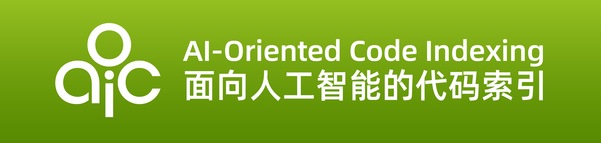
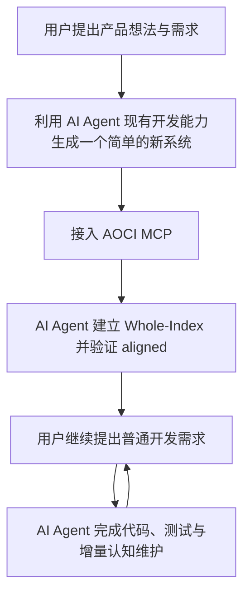
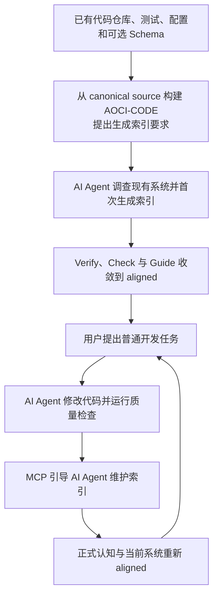

# AOCI-CODE

**AOCI-CODE 是一种为 AI Agent 建立软件项目全局认知的索引方法，可提供持久化、可治理的代码仓库认知地图。**

[🇺🇸 English](README.md) | 🇨🇳 简体中文


> [!IMPORTANT]
> AOCI-CODE v0.1.0-rc5 是当前发布候选版本。它是采用 FSL-1.1-MIT 的 Fair Source/source-available 软件；具体条款见 [LICENSE](LICENSE)。可以从 canonical source 构建，也可以使用 [v0.1.0-rc5 GitHub Release](https://github.com/aoci-spec/aoci-code/releases/tag/v0.1.0-rc5) 提供的签名包；使用前请遵循[发布验证流程](https://github.com/aoci-spec/aoci-code/blob/v0.1.0-rc5/docs/install.md#signed-github-release-packages)。

## 🧠 AOCI 是什么？

**AOCI（AI-Oriented Cognition Infrastructure）是位于 AI Agent 与软件系统之间的认知基础设施。**

大模型负责推理，Agent 负责规划和执行，AOCI 则将代码、配置、测试和数据库结构整理为与当前系统版本绑定、可持续维护的系统认知，供 Agent 在行动前读取和理解。

## 🗺️ AOCI-CODE 是什么？

AOCI-CODE 源于 AOCI。简单来说，AOCI-CODE 会对源代码、数据库结构及其他真正影响 AI 理解和修改的关键信息进行压缩，形成符号与语义结合的高信息密度索引，并用纯文本表示。

AOCI-CODE 通过 `aoci` CLI 和 MCP Server 将这套方法落实到项目中。

在模型上下文有限的情况下，AI Agent 可以先读取这套索引，一次性获得项目的大部分关键信息，再进入具体开发任务，从而减少反复搜索和重新理解代码的成本，提高跨任务、跨会话的开发衔接效率。

- **索引不是一次性摘要**：索引会随系统持续演进，长期保存在项目中，可以通过 Git 比较差异、审查、版本化和回滚。
- **不只是记录“文件在哪里”**：AOCI-CODE 还会保存对象职责、强关系、公开契约、事务边界、兼容性约束，以及其他难以从代码结构直接推断的信息。
- **索引具有良好的可移植性**：索引随项目保存，不绑定特定模型、AI Agent 或单次会话。在索引与代码版本一致时，不同 AI Agent 和后续会话都可以读取并复用同一份系统认知，无需每次从头理解。
- **代码与数据库可以统一理解**：模型可以为数据库表建立独立的表级索引。Code Cognition 和 Database Cognition 一起交付时，AI Agent 能更完整地理解整个软件系统。


本文中的名称分工如下：**AOCI** 指认知范式和协议，**AOCI-CODE** 指承载该方法的项目与索引本身。

## ⚙️ AOCI 如何工作

在当前 Volume-first 布局中，AOCI-CODE 将索引组织为随项目保存、受治理的纯文本认知资产：

- **Root（`aoci.txt`）**：声明当前 CognitionSet 的组成和激活入口；
- **Meta（`aoci.meta.txt`）**：保存标签字典、FRAS 规则与模型创作约束；
- **Code（`aoci.code.txt`）**：保存代码及其他仓库资产的模型创作认知；
- **Database（`aoci.database.txt`）**：启用 Database Cognition 时保存可选的表级认知。

Root、Meta 与参与其中的对象 Volume 共同组成当前 Whole-Index。在这些资产之上，工作流分为三个阶段：

1. **建立受治理的认知**：模型读取源代码和已接受的证据；AOCI-CODE 治理 Managed Scope，以及模型为具有 `index` 角色的受管对象创作的认知。
2. **行动前交付认知**：Agent 读取 Rules、实时 Guide 和当前 Whole-Index，再针对当前任务核对源码与其他证据。
3. **在变更验证后维护认知**：代码与测试稳定后，项目 Rules 和 AOCI MCP 工作流会引导 Agent 更新受影响的 Entries，并让正式认知回到 `aligned`。

这些纯文本认知资产随项目保存并可由 Git 版本化。当认知与当前系统版本保持一致时，不同 AI Agent 和后续会话可以读取并复用同一份 Whole-Index。

## 🚀 一键使用

把下面这段话发给你的 AI Agent，它会下载 AOCI-CODE 并完成接入；重启 Agent 后，再发第二段让它建立索引：

```text
AOCI-CODE 项目地址：https://github.com/aoci-spec/aoci-code

请从 https://github.com/aoci-spec/aoci-code/releases 下载适合当前操作系统和 CPU 架构的最新发布包，并按照发布页的安装说明完成校验。如果没有适合当前系统的发布包，或者我明确要求使用最新源码，请从官方仓库构建。

解压后，请把 aoci（Windows 为 aoci.exe）放在稳定的绝对路径中，然后用这个绝对路径为我的项目完成以下任务：

1. 运行 init，完成初始化并接入当前宿主的 MCP；如果这个宿主不写入项目配置（例如 Cursor），请把需要我手工粘贴的配置给我
2. 运行 scan

   scan 按 git 的忽略权威取文件，所以不要把 init 写入的认知资产（aoci.txt、aoci.meta.txt、aoci.code.txt、AGENTS.md）加进 .gitignore 或 .git/info/exclude —— 被忽略的会被静默跳过，索引建不起来。init 自己写的宿主配置忽略项保持原样。

3. 提示我重启 Agent，让新写入的 MCP server 生效

这三步做完就停下，先不要建立索引 —— 重启后我会让你继续。
```

重启 Agent 之后，再发这一段：

```text
先确认 AOCI MCP 已接入，然后请为这个项目建立 AOCI 索引。
```

索引由 AOCI 的 MCP 工具创作，而 `init` 刚写入的 MCP server 在当时那个会话里还没有加载，所以建立索引必须放在重启之后。支持动态加载 MCP 的宿主可能不必重启；判断方法见“宿主集成”。

## 🔌 手动接入

请从 canonical source 获取 AOCI-CODE，或使用 GitHub Releases 提供的签名包。使用预构建二进制前，请按[安装指南](https://github.com/aoci-spec/aoci-code/blob/v0.1.0-rc5/docs/install.md#signed-github-release-packages)选择基础、推荐或完整校验层级，并准确说明已完成的层级。请把本 README 和已验证二进制的稳定绝对路径交给 Codex、Claude Code、Cursor、OpenCode 等受信任 AI Agent。AI Agent 可以按照项目内的说明运行初始化、完成 MCP 接入并建立第一份索引。

首次生成完整认知所需时间取决于仓库规模。正常接入过程包括：准备二进制文件、让 AI Agent 或用户初始化目标仓库、在宿主中提出“建立索引”、验证对齐。后续开发不需要在每个需求末尾重复提醒“维护索引”；项目规则和 AOCI MCP 工作流会在受管对象变化后引导 AI Agent 完成增量认知维护。

### 0. 🧰 环境要求

- 经验证的 Release 软件包，或 canonical AOCI-CODE 源码仓库的工作副本；
- 从源码构建时，需要 `go.mod` 声明的 Go 工具链、`make` 及仓库要求的其他工具；使用已验证的 Release 二进制本身不需要 Go 或 `make`；
- 一个受支持的 MCP 宿主，例如 Codex、Claude Code、Cursor 或 OpenCode；
- 对目标仓库的正常读写权限。

签名包路线和可执行验证命令见[安装指南](https://github.com/aoci-spec/aoci-code/blob/v0.1.0-rc5/docs/install.md#signed-github-release-packages)；下面仍保留从源码构建的路线。

### 1. 📦 当前 RC：使用经验证的软件包或从源码构建

签名 Release 二进制报告 `aoci version 0.1.0-rc5`。源码构建则报告由精确
Git checkout 派生的版本，例如 Release tag 之后的
`v0.1.0-rc5-1-g<short-commit>`；工作树不干净时还会带 `-dirty`，并单独报告
Git commit。二者表示不同构建输入，不是版本冲突。

使用 GitHub CLI 下载前先完成认证，再下载带 tag 的 Release 资产：

```bash
gh auth login
gh release download v0.1.0-rc5 --repo aoci-spec/aoci-code
```

如需匿名下载，请在浏览器中打开
[v0.1.0-rc5 Release 页面](https://github.com/aoci-spec/aoci-code/releases/tag/v0.1.0-rc5)，
并下载所需 archive 与验证资产。

克隆 canonical 仓库、构建二进制，并保持构建结果的路径稳定：

```bash
git clone https://github.com/aoci-spec/aoci-code.git
cd aoci-code
mkdir -p build
make build
./build/aoci --version
```

Windows 可以在 PowerShell 中从同一 canonical source 显式构建 `aoci.exe`：

```powershell
git clone https://github.com/aoci-spec/aoci-code.git
Set-Location .\aoci-code
New-Item -ItemType Directory -Force .\build | Out-Null
make build
Copy-Item .\build\aoci .\build\aoci.exe -Force
.\build\aoci.exe --version
```

然后把本 README 提供给已经信任该项目的 AI Agent，并提出：

```text
请阅读这份 AOCI-CODE README，使用已构建 aoci 二进制的稳定绝对路径，
为当前项目完成 AOCI 初始化和 MCP 接入，并运行 scan。做完就停下并提示我重启
Agent，重启后我会让你建立索引。
```

AI Agent 应识别当前项目根目录、使用已构建二进制的稳定绝对路径、执行适合当前宿主的初始化，并在需要宿主重启或真实人工批准时明确提示用户。构建结果可以保留在 AOCI-CODE 源码工作区，也可以放到统一的稳定工具目录，只要 MCP 配置引用正确的绝对路径。

### 2. ⚙️ 手工初始化路线

如果希望自己先完成初始化，可以在目标仓库根目录运行，或通过 `--repo` 传入明确路径：

```bash
AOCI=/absolute/path/to/aoci-code/build/aoci
"$AOCI" --repo . init --locale zh-CN --agent codex
"$AOCI" --repo . scan
```

`init` 会写入 Locale 配置、托管的 `AGENTS.md` 规则区块、Git 边界以及语义为空的最小认知骨架；不同宿主的配置或提示方式并不相同，详见“宿主集成”。它不会根据文件名、目录或 AST 伪造业务语义。

已有项目可运行 `aoci config set locale zh-CN` 或 `aoci config set locale en-US`，统一切换界面和后续 Entry 作者化语言。命令会立即对齐正式 `#Locale` 标记；现有普通 Entry 不会被批量翻译，只有以后新建或确实更新的 Entry 使用配置中的 Locale。修改后需重启宿主中的 AOCI MCP 进程。

对于全新仓库，首次 `scan` 会建立 Managed Baseline。对于已经拥有受治理 Baseline 的项目，新增、移除或改变受管范围应进入正式 Scope Change 流程，而不是把 `scan --force` 当作重新定义治理事实的捷径；`--force` 也不能洗掉未解决的漂移、Receipt 或 Recovery 边界。

<details>
<summary>Windows PowerShell</summary>

```powershell
$Aoci = (Resolve-Path "C:\path\to\aoci-code\build\aoci.exe").Path
& $Aoci --repo . init --locale zh-CN --agent codex
& $Aoci --repo . scan
```

请确认 `$Aoci` 指向稳定的绝对路径。

</details>

### 3. 🤖 让 AI Agent 建立第一次认知（重要）

初始化和 `scan` 完成后，先看当前 Agent 会话里有没有出现 AOCI 工具；没有就刷新或重启它。然后在目标项目的 AI Agent 中输入：

```text
先确认 AOCI MCP 已接入，然后请为这个项目建立 AOCI 索引。
```

宿主应读取项目内的 AOCI Rules 和实时 Guide，调查源码、测试、配置及相关证据，然后为 `index` 角色的受管对象创作 FRAS 候选。普通用户无需手工编排 Plan、Stage、Check、Diff、CAS 或 Apply。

首次建立完成后，用户可以像平常一样直接提出开发需求，例如：

```text
给任务增加优先级，完成前后端、数据库与测试修改。
```

用户不必补充“最后维护 AOCI 索引”。项目规则和 MCP 会让 AI Agent 在开发完成、代码与测试稳定后检查认知变化并按正式流程维护受影响 Entry。当项目采用 `automation.mode=auto` 时，AOCI-CODE 只应在需要真实人工批准、必须执行外部操作、无法证明 Recovery、安全检查失败或发现第三方并发冲突时打断用户；其他自动化模式遵循各自的运行时合同。

### 4. ✅ 验证对齐

引导流程完成后运行：

```bash
"$AOCI" --repo . verify
"$AOCI" --repo . check
```

预期结果是正式认知与当前受管源码重新收敛到 `aligned`。如果未对齐，请先查看实时 Guide，不要在包装脚本中复制内部状态机：

```bash
"$AOCI" --repo . index agent guide --agent codex --json
```

### 5. 🩺 运行基础诊断

```bash
"$AOCI" --repo . capabilities
"$AOCI" --repo . doctor
```

要确认宿主此刻真正连着哪一个 AOCI，看服务端自报的身份，而不是磁盘上的文件：任何 `aoci_overview` 的 `check_only` 响应、或任何 `aoci_maintain` 响应里，`cognition_receipt.mcp_service_version` 是正在运行的版本，`runtime_repository_root` 是它治理的仓库。对应的二进制路径是项目 `.mcp.json` 或等价宿主配置（`.codex/config.toml`、`opencode.json`、`.cursor/mcp.json`）里的 `command`。替换磁盘上的字节不会改变已在运行的 MCP 进程，因此升级或回滚后要按这些事实复核。

如需一次性演练，可使用仓库中的 `examples/minimal-repository`。

<details>
<summary>开发者：从源码构建 AOCI-CODE CLI</summary>

如果你正在开发 AOCI-CODE 本身，普通开发和提交前先运行快速质量门禁：

```bash
make fast
```

需要完整信心验证和可执行文件时运行：

```bash
make full
./build/aoci --version
```

`make full` 是 Full Confidence 门禁，并已包含 `make build`；`make check` 只是兼容别名，同样进入完整门禁，不需要与 `make full` 机械重复。稳定版本排练使用 `make release-check`。如果只需直接构建，可以运行：

```bash
mkdir -p build
CGO_ENABLED=0 go build -o build/aoci ./cmd/aoci
```

AOCI-CODE CLI 是一个不依赖 CGO 的 Go 单二进制文件。当前 `make build` 目标写入 `build/aoci`；PowerShell 示例再把该 Windows PE 输出复制为惯用的 `build/aoci.exe`。发布或交付前，请以实际二进制的 `--version`、`capabilities` 和正式 Release Manifest 输出为准，不要只依赖 README 中的版本字符串。

</details>

## 📁 初始化后会出现什么？

典型的 Volume-first 仓库包含以下正式认知资产：

```text
aoci.txt                    Root：声明当前认知集合及参与 Volume
aoci.meta.txt               Meta：标签字典、FRAS 规则与创作约束
aoci.code.txt               Code：代码与仓库资产的模型创作认知
aoci.database.txt           Database：可选的表级认知；默认不存在
.aoci/
├── config.json             团队策略、Locale、Scope 与预算
├── baseline.json           源码、认知和数据库绑定的治理基线
├── curation.json           可选的文件级 include/exclude 决策
└── ...                     草稿、Ledger、事务与恢复证据，通常不进入 Git
```

新项目初始化时会创建 Volume Root、Meta 和一个空的 Code Volume；Database 默认不存在。AOCI-CODE 不会自动生成仓库业务语义或 Database 语义。

`aoci init --agent <name>` 还会写入宿主集成配置（`.mcp.json`、`.claude/settings.json`、`.codex/config.toml` 或 `opencode.json`），其中的命令与仓库路径是本机绑定的绝对路径。请把这些文件加入仓库的 `.gitignore` 且不要提交：提交后的副本在任何其他机器上都会失效，而安装器按条目是否存在做幂等判断，在那台机器上重跑 `init` 会静默保留坏路径。


## 🔄 一次完整开发任务如何运行

下面两个图描述用户实际经历的开发流程，不用于解释 AOCI 的内部实现原理。

### 🆕 新建项目：先建立一个简单系统，再接入 AOCI 持续演进



*新系统不要求从第一行代码开始就安装 AOCI-CODE。用户可以先用 AI Agent 现有开发能力完成产品雏形，建议约 1—3 万行（不是硬性阈值）；希望从项目早期就获得跨会话认知的团队，也可以更早接入。*

### ♻️ 已有项目：对当前代码仓库建立索引后持续迭代



*两个流程在首次索引完成后进入同一种日常使用方式：用户只描述业务或工程需求，AI Agent 负责结合 Whole-Index 调查当前证据、完成开发和验证，并在收尾阶段通过 MCP 维护变化对象。用户不需要学习内部 Plan、Stage、Diff、CAS 或 Baseline 命令，也不需要在每个 Prompt 中重复维护要求。*

在任何正式写入开始之前，如果完整批次被拒绝，AOCI 索引保持不变。正式写入开始以后若流程中断，系统会保留不可变 Intent、写入证据和 Recovery 状态，并根据可证明的后像继续 Resume，或按精确前像回滚；遇到第三方字节冲突时失败关闭，不会用“继续写完”覆盖外部修改。

最终状态会明确返回 `applied`、`repair_required` 或 `stopped`。`stopped` 不是成功，也不等于一定没有写入；应检查 `failed_step`、正式写入证据和 Guide 给出的恢复动作。

## 🤝 模型与 AOCI-CODE 如何分工

### 🧠 模型负责语义

宿主模型读取源码、测试、配置、文档和必要证据，然后判断：

- 对象真正承担什么职责；
- 哪些文件、模块或数据库对象是安全修改时必须关注的强关系；
- 它暴露哪些 API、命令、格式或可观察合同；
- 哪些事务、权限、并发、缓存、部署、兼容或历史约束不能从普通结构直接推出。

AOCI-CODE 不会根据文件名、路径、扩展名、AST 或模板自动拼装 FRAS，也不会静默改写模型语义。

### 🛡️ AOCI-CODE 负责治理

AOCI-CODE 负责：

1. 建立 Safe Inventory、Managed Scope 与当前 Baseline；
2. 交付并确认当前 Whole-Index 身份；
3. 生成确定性的 Plan、目标集合和源码 SHA-256；
4. 校验候选结构、标签字典、关系身份、Scope、Ownership、预算和影响范围；
5. 保存 Check、Diff 与审阅内容绑定；
6. 使用跨进程锁、CAS 和 AtomicWrite 提交完整批次；
7. 推进 Baseline、追加 Ledger，并在写后故障时保留恢复证据；
8. 通过 Verify、Check 与 Guide 重新证明当前治理状态；
9. 从权威资产派生 Lineage、Relations、Impact、Snapshot 与 Evolution 观察，而不创建第二事实源。

机器全绿只表示已编码的结构与治理合同成立，**不表示每一条模型语义都绝对正确**。

## 🗂️ AOCI 索引是如何组织的？

从概念上看，AOCI 索引包含“索引规则”和“索引条目”两层含义。当前产品同时兼容两种物理布局，它们不能混为同一种文件格式：


### 🧱 Volumes v1 布局

Volume-first 项目把职责拆开：

- `aoci.txt` 只作为 Root，声明参与当前 CognitionSet 的 Volume；
- `aoci.meta.txt` 保存 Meta、标签字典、FRAS 规则、预算和创作合同；
- `aoci.code.txt` 保存 Code 对象 Entry；
- `aoci.database.txt` 在启用 Database Cognition 时保存数据库对象 Entry。

Code 和 Database Volume 继续复用同一套 FRAS 词法结构，但它们拥有独立的对象身份、Evidence 绑定、所有权和生命周期。Root、Meta 与对象 Volume 共同构成 Whole-Index；不能只读取 `aoci.txt` Root 就声称已读取完整系统认知。

可以把它理解成一张地图：

- 索引规则相当于地图的**图例和坐标体系**；
- 索引条目相当于地图中描述每个地点的**具体标记**；
- Root 相当于当前地图集的**目录和版本入口**；
- Volume 相当于由同一治理协议管理、但证据来源和生命周期不同的**分册**。

### 🧾 索引头长什么样

Root 与 Meta 都以机器读取的头部行开始。下面是 `aoci init` 为一个名为 `my-service` 的新 `zh-CN` 项目写出的内容，先看作为激活入口的 Root：

```text
#AOCI-ROOT-MANIFEST: 1
#Format-Version: cognition-volumes/v1
#Locale: zh-CN
#Project: my-service
#Global-Invariants: -
#Volume: id=meta kind=meta path=aoci.meta.txt format=meta-v1 depends=- state=enabled
#Volume: id=code kind=code path=aoci.code.txt format=object-fras-v2 depends=meta state=enabled
```

每一行 `#Volume:` 声明一个参与其中的 Volume，带上它的身份、种类、路径、格式、依赖和激活状态。没有在这里声明的 Volume 就不属于当前 CognitionSet —— 无论工作树里还放着什么。启用 Database Cognition 会再加一行：`#Volume: id=database kind=database path=aoci.database.txt format=table-fras-v2 depends=meta state=enabled`。

Meta 随后以约束每一条 Entry 的规则开头：

```text
#AOCI-META-VOLUME: 1
#Object-Protocol: repository-cognition-object/v2
#FRAS-Discipline: 2
#FRAS-v2-Limits-Authority: machine-contract
#S-Admission: non-inferable-and-error-preventing
#S配额: C9-8≤600 C7-4≤500 C3-1≤50
#Object-Kinds: code=file database=table
```

其中最吃劲的是 `#FRAS-v2-Limits-Authority: machine-contract`：字段上限归二进制所有，而不归这段文本，所以项目无法靠改自己的 Meta 把上限放宽。`#S-Admission` 与 `#S配额` 专门约束 S 字段 —— 什么才允许写进去，以及每个重要度档位能花多少字符。标签字典紧跟在这些行之后，完整内容在下文展示。

Code Volume 只以一行 `#AOCI-CODE-VOLUME: 1` 开头，其后全是目录段与 Entry。

这些是新项目的起始值，不是固定的协议常量。此后以每个仓库自己的 Root 和 Meta 为准：老项目可能带着自定义标签字典，而用 `--locale en-US` 初始化的项目会写 `#Locale: en-US`，配额那一行的键名也随之变成英文的 `#S quota:`。

### 📐 索引规则定义什么？

| 规则 | 作用 |
| --- | --- |
| **标签字典** | 使用紧凑标签表示对象所在的架构层、功能领域、重要程度、技术特征和规模 |
| **FRAS 字段** | 规定每条索引应记录对象的职责、强关系、公开接口和关键约束 |
| **关系规则** | 规定对象之间的关系应如何引用，避免含糊或无法验证的描述 |
| **范围与所有权** | 规定哪些对象以 `index` 角色进入认知，以及每个对象应属于哪个 Cognition Volume |
| **长度与预算** | 控制索引的信息密度，避免把源码或普通摘要直接复制进索引 |
| **验证规则** | 规定候选条目进入正式索引前必须满足的结构和治理条件 |

在 Volumes v1 中，这些规则由项目的 Meta Volume 保存；在 Legacy 布局中，它们位于单体 Header。不同项目可以使用不同的标签字典，但 FRAS 的基本语义结构保持一致。

README 只介绍这些规则的阅读方法。具体、可执行的规则应以当前项目的 Meta 或 Legacy Header、AOCI Guide 和正式规范为准。

## 🧾 一条索引记录了什么？（FRAS）

建立规则后，模型会为每个 `index` 角色的受管对象编写一条索引。`observe` 角色只参与变化观察，`exclude` 角色形成明确负空间，两者都不拥有正式 Entry。AOCI 使用 **FRAS** 组织一条 Entry 中最重要的四类语义：

- **F — Function**：这个对象负责什么；
- **R — Relations**：安全理解或修改它时，还必须关注哪些对象；
- **A — API**：它向外提供哪些接口、命令、格式或可观察契约；
- **S — Non-obvious constraints**：补充 F、R、A 尚未表达、但对理解或安全修改这个对象很重要的信息，例如关键约束、例外、边界和特殊语义；S 不应重复前三个字段。

例如，在 `===.../internal/fs/===` 目录段内，Entry 使用 basename：

```text
atomic.go[CG9L]: F:提供持久化替换 CAS、创建 CAS、原子写入和禁止覆盖的恢复移动 | R:code:internal/fs/atomic_exchange_linux.go,code:internal/fs/atomic_exchange_windows.go,code:internal/fs/lock.go | A:AtomicWrite,AtomicWriteCAS,AtomicCreateCAS,AtomicMoveCAS | S:原生发布绝不会降级为覆盖式重命名；遇到竞态、不安全类型或无法验证的字节时，必须保留第三方状态并失败关闭
```

目录段和 basename 共同解析出 Code 对象身份；在需要跨 Volume 或系统投影时，可展开为规范身份，例如 `code:internal/fs/atomic.go`。Database 对象使用自己的规范身份，例如 `database://primary/public/orders`。

这条索引可以拆成两部分理解：

```text
atomic.go [CG9L]
└──对象──┘ └标签┘

F: 核心职责
R: 必须一起理解的强关系
A: 对外接口或契约
S: F、R、A 之外的重要补充信息
```

| 字段 | 回答的问题 | 示例内容 |
| --- | --- | --- |
| **F — Function** | 这个对象的核心职责是什么？ | 提供持久化替换 CAS、创建 CAS、原子写入和禁止覆盖的恢复移动 |
| **R — Relations** | 修改它时必须同时查看什么？ | `atomic_exchange_linux.go`、`atomic_exchange_windows.go`、`lock.go` |
| **A — API** | 外部可以依赖什么？ | `AtomicWrite`、`AtomicWriteCAS`、`AtomicCreateCAS`、`AtomicMoveCAS` |
| **S — Non-obvious constraints** | F、R、A 之外还有哪些重要信息必须补充？ | 原生发布不得降级为覆盖式重命名；失败时保留第三方状态并失败关闭 |

紧凑标签为对象提供架构层、功能域、重要度、可选技术特征和规模坐标。标签字典由项目自己的 Meta Volume 或 Legacy Header 定义；程序验证字典和结构，但不决定业务含义。

**S 不是 Synopsis、普通摘要，也不是 F、R、A 的重复表达。** 它用于补充前三个字段没有覆盖、但会影响理解或工程正确性的重要信息，例如：

- Redis 访问失败后必须回退数据库；
- 某张表不能进入 AutoMigrate；
- 某个旧版兼容分支不能按常规逻辑清理；
- 写入失败时必须保留原始文件。

模型负责根据真实源码和证据编写这些语义；AOCI-CODE 负责验证条目结构、绑定源文件，并治理它如何进入正式索引。

### 🏷️ 阅读初始标签字典

下面内容从当前 `zh-CN` Volume Meta 模板（`textassets/zh-CN/templates/volume-meta.txt.tmpl`）逐字引用。这是一份初始字典，不是所有项目通用的固定词表：每个仓库仍以自身正式 Meta 为准。初始模板没有声明 D 字典；D 仍是可选维度，只有当前正式 Meta 声明后才能使用。

<details>
<summary>查看受治理的初始字典</summary>

```text
#Canonical-Tag-Authoring: compact A+B+C+[D]+E; dotted形态仅用于读取兼容
#Code canonical identity example: code:path/to/file.go
#Code Entry example: file.go[EG7T]: F:运行示例应用 | R:- | A:- | S:-
#[Tag dictionary: code]
#A Layer: C-共享基础 E-入口边界 A-应用编排 D-领域逻辑 K-算法计算 M-中间件 P-持久化 I-集成适配 R-运行基础 L-库与SDK F-声明配置 O-运维交付 T-测试验证 S-文档规范 X-开发工具 Z-其他
#B Module: G-跨域通用 U-用户交互 B-核心业务 D-数据状态 I-身份权限 N-网络协议 M-消息事件 S-安全隐私 C-配置策略 O-可观测性 R-可靠性恢复 P-性能资源 W-流程调度 A-分析智能 H-硬件设备 L-本地化 V-构建发布 Q-质量保障 E-扩展插件 Z-其他
#C Importance: 9-最高 8-很高 7-高 6-较高 5-中等 4-较低 3-低 2-很低 1-最低
#E Scale: L-大>400 M-中200-400 S-小100-200 T-微<100
#[Tag dictionary: database]
#A Layer: E-实体主表 T-事务事实 R-关联映射 M-明细从属 C-参考字典 S-状态存储 H-历史版本 L-日志审计 Q-队列发件 A-聚合投影 K-键值配置 B-文档大对象 Z-其他
#B Module: G-跨域通用 B-核心业务 I-身份权限 T-组织租户 U-用户体验 F-财务计费 K-内容知识 C-配置策略 W-流程任务 M-消息事件 N-外部集成 S-安全隐私 O-可观测审计 R-可靠性恢复 P-性能资源 A-分析智能 H-硬件设备 L-本地化 V-构建发布 Q-质量测试 E-扩展插件 Z-其他
#C Importance: 9-最高 8-很高 7-高 6-较高 5-中等 4-较低 3-低 2-很低 1-最低
#E Scale: L-大>400 M-中200-400 S-小100-200 T-微<100
```

</details>

按照初始 Code 字典，`[CG9L]` 表示 `C` 共享基础、`G` 跨域通用、`9` 最高重要度、`L` 大规模；其中没有 D 值。这段内容只解释如何阅读现有 Entry，不规定模型应该怎样分配标签。模型仍须依据源码和已接受证据，从当前项目 Meta 中选择标签。

## 📚 Cognition Volumes

AOCI-CODE 维护一个逻辑 Whole-Index，但不同类型的认知拥有独立的索引、所有权和生命周期。

| Volume | 职责 |
| --- | --- |
| **Root** | 声明当前 CognitionSet 的组成、依赖和激活入口；最后发布，避免部分资产被误认为完整集合 |
| **Meta** | 保存标签字典、FRAS 规则、配额和模型创作合同 |
| **Code** | 保存代码、测试、配置、文档和运维资产的仓库认知对象 |
| **Database** | 保存可选的表级认知对象，并与已接受的 Schema Evidence 绑定 |

每个对象只有一个合法 Owner。跨 Volume 放错对象会产生 Ownership Conflict；AOCI-CODE 仅在机器能证明错误 Owner、正确 Owner 和当前对象事实时修复，不会根据名称相似度猜测归属。

Code Volume、Database Volume 和 Scope 可以共同演进，但它们共享同一个受治理提交边界。单个 Domain 的 Apply 不应丢失其他 Domain 已有的 Baseline 投影；Volume Apply、Baseline 更新和相关 Scope 投影必须作为同一 Cognition Transaction 的一致结果发布，或者进入可证明的 Recovery，而不是留下“文件已成功但其他 Volume 无基线”的半完成状态。

## 🔌 宿主集成

`aoci init` 始终写入托管的 AI Agent 规则，但宿主接入行为不同：Codex 写入项目级 MCP 配置，并可通过 `--hooks` 选择安装上下文压缩prompt与 `SessionStart(compact)`，但仍不安装文件编辑Hook；Claude Code 可以安装 `PreToolUse` Hook；OpenCode V1 使用严格的项目级 `opencode.json`；Cursor 只返回参考配置片段，不写入项目配置。配置完成后，先检查当前宿主会话是否已显示 AOCI 工具；仅在尚未加载新 server 时刷新或重新打开项目会话。新会话通常先读取一次 Rules 与 Whole-Index；只要认知身份仍有效且没有发生已知Host上下文压缩，后续任务会复用当前认知，不会机械地重复注入整个索引。

| 宿主 | 当前接入方式 | 边界 |
| --- | --- | --- |
| **Codex** | 项目级 stdio MCP；可选 `--hooks` 压缩prompt与 `SessionStart(compact)` | 必须通过Codex `/hooks` 审查并信任；不安装文件编辑Hook |
| **Claude Code** | 项目级 MCP；可选 `PreToolUse` 薄守卫 | Hook 只负责写前提示或 Stale 守卫，不是 AI Agent runtime |
| **OpenCode V1** | 通过 `--agent opencode` 写入严格的项目根 `opencode.json` | 工具已加载可直接继续；否则刷新或重新打开项目会话 |
| **Cursor** | 返回 MCP 参考配置片段 | 不写入项目配置，仍需按宿主手工完成接入 |
| **其他 MCP Host** | 连接标准 stdio Server | 需要手工配置并完成宿主专项验证 |

```bash
aoci --repo /absolute/path/to/repository init --agent codex
aoci --repo /absolute/path/to/repository init --agent codex --hooks
aoci --repo /absolute/path/to/repository init --agent claude --hooks
aoci --repo /absolute/path/to/repository init --agent opencode
aoci --repo /absolute/path/to/repository init --agent cursor
```

Codex `--hooks` 把压缩handoff限制为receipt身份、未完成write或Recovery状态，以及立即重载指令；不得保留或摘要Whole-Index或Overview/Attestation正文。`PreCompact` Hook不能向宿主压缩输入注入文本，也不能从中删除历史，因此无法单独落实该边界。依赖此能力前，应通过Codex `/hooks` 审查并信任安装的项目Hook。

旧版输出保留 Level 0—4，用于兼容既有宿主和报告。当前 `cognition-state/v2` 将“模型认知可用度”表达为 Level 0—3，并把严格证明和治理事实拆成独立维度：

| 状态 | 含义 |
| --- | --- |
| `delivery_verified` | 当前 Index 已装载，Host 交付得到确认；严格 Challenge 可能仍未完成 |
| `model_cognition_usable` | 模型已获得可用于任务的系统框架认知 |
| `strict_attestation_verified` | 当前 Index 身份、Entry 序列、数量与 Challenge 严格通过 |
| `governance_aligned` | 正式认知、Baseline 和治理状态当前对齐 |
| `current_system_cognition_reliable` | 当前完整系统认知可以无保留地作为现行系统级先验使用 |

这些维度不能互相替代。Attestation 只证明当前材料的交付覆盖度与身份一致性，不代表 AI Agent 对任意未来任务都已充分理解；只有 `current_system_cognition_reliable=true` 才允许无保留地声称掌握当前完整系统认知。

## ⌨️ 常用 CLI 命令

| 命令 | 用途 |
| --- | --- |
| `aoci init` | 安装仓库合同和不含业务语义的初始 Volumes 布局 |
| `aoci scan` | 为首次接入建立 Baseline；已有 Managed Baseline 的范围变化进入 Scope Change |
| `aoci status --deep` | 仅用于 Legacy 深度状态，不是 Cognition Volumes 维护路线 |
| `aoci verify` | 报告 Missing、Orphan、Stale 和 Unbaselined 事实 |
| `aoci check` | 运行聚合治理门禁 |
| `aoci index agent guide` | 进入确定性的宿主智能体工作流 |
| `aoci capabilities` | 查看当前二进制提供的能力 |
| `aoci doctor` | 诊断仓库和宿主集成 |
| `aoci database` | 显式配置并验证 PostgreSQL/MySQL/openGauss Schema Evidence |
| `aoci database source access` | 只读检查数据库凭据引用是否已由外部环境提供，不返回凭据值 |
| `aoci database cognition bootstrap` | 为已对齐的 Code-only Volumes 项目添加 Database Cognition |
| `aoci cognition plan` | 只读规划 Bootstrap 或 Legacy 迁移，并比较完整目标 Code Volume |
| `aoci cognition plan diff --target-index <file>` | 只读比较正式 Code 与完整非权威 target；最终 source-bound 提升只能使用 `aoci_update_entry.target_index` |
| `aoci cognition bootstrap` | 仅治理未初始化的仓库，或旧版 `init` 写出的精确零 Entry Legacy 最小骨架；它绝不针对已初始化的 Volumes v1 仓库 —— 零 Entry 的 Volumes 骨架要先跑 `aoci scan`，再走 Guide 和无参数 `aoci_maintain` —— 成熟的 Legacy 项目则应使用 Migration |
| `aoci cognition migration` | 治理 Legacy 迁移的快照、映射、批准、应用、恢复或回滚 |
| `aoci cognition system lineage` | 派生重要认知对象的来源与绑定链 |
| `aoci cognition system relations` | 派生 Root/Volume 结构关系和当前正式 R 关系投影 |
| `aoci cognition system impact` | 沿显式正式 R 关系查询数据库变化可能触达的代码认知对象 |
| `aoci cognition system snapshot` | 输出当前认知集合的只读快照投影 |
| `aoci cognition system evolution` | 比较调用方提供的历史 Snapshot 与当前投影 |
| `aoci mcp` | 启动 stdio MCP Server |

成熟的 Legacy 索引应从 `aoci cognition onboard start` 进入升级流程；该流程保留
已有模型语义映射与人工摘要批准边界。Apply 达到已对齐且含 Code Volume 的
Volumes v1 布局后，`aoci_rules` 可立即使用 `module_path`，无需再创建模块专用索引
格式。target Diff 本身不是 Apply；实现稳定后，使用互斥的
`aoci_update_entry` `target_index=aoci.code.target.txt` 模式，由Go绑定最终源码
SHA并一次整批Apply，不再进行模型创作。

常用组合：

```bash
# 初始化与首次 Baseline
aoci --repo . init --locale zh-CN --agent codex
aoci --repo . scan

# Cognition Volumes 的验证与治理门禁
aoci --repo . verify --json
aoci --repo . check --json

# 实时 Guide；不要在包装器中复制状态机
aoci --repo . index agent guide --agent codex --json

# 能力与诊断
aoci --repo . capabilities
aoci --repo . doctor

# 数据库 Evidence、Access 与 Cognition 生命周期
aoci --repo . database --help
aoci --repo . database source access --source primary --json
aoci --repo . database cognition status
aoci --repo . cognition onboard start --json
aoci --repo . cognition plan --help
aoci --repo . cognition plan diff --target-index /path/to/target.aoci.code.txt --json

# System Cognition 派生观察
aoci --repo . cognition system lineage
aoci --repo . cognition system relations

# MCP stdio Server
aoci --repo . mcp
```

Plan、Stage、Check、Diff、Apply、Curation、Scope Change、Bootstrap、Migration 和恢复命令仍然存在。普通用户应遵循运行中二进制返回的 Guide，而不是把内部状态机复制到脚本中。

### 🔒 关于“只读”命令

verify、check、index score 与 index inventory 的“只读”仅表示不修改正式索引或Baseline，不等同于严格零文件写入：Ledger启用时四者都可能追加本地Ledger，verify还会尝试写入Verify History；审计写入失败不改变既有退出码与治理判据。

如果必须保证零文件写入，请使用隔离副本。System Cognition 命令不会创建第二套正式状态，但其普通 CLI 调用仍应遵循当前版本对 Ledger 和本地历史记录的运行时合同。当前公开 CLI 不提供一次性关闭所有 Ledger 与 Verify History 写入的总开关。

## 🧩 MCP Server

`aoci mcp` 无需常驻 Daemon，通过 stdio 暴露固定九个工具：

| 类别 | 工具 |
| --- | --- |
| **认知读取** | `aoci_rules`、`aoci_overview`、`aoci_get_entries`、`aoci_search` |
| **认知维护** | `aoci_maintain`、`aoci_update_entry`、`aoci_remove_entry` |
| **辅助证据** | `aoci_header`、`aoci_report` |

MCP 模式下，stdout 仅用于 JSON-RPC，日志和诊断写入 stderr。运行中二进制提供的 Tool Description、JSON Schema 和机器状态值才是权威；README 只是使用入口。

当前 AOCI-CODE Release 的 System Cognition 能力通过现有 CLI 和治理内核提供，不增加第十个 MCP 工具，也不改变已有九工具的名称、用途或 stdio 合同。

## ⏳ 长时间运行与 Whole-Index 交付

在一次新对话开始时，AI Agent 通常会加载一次完整 Overview，以建立与当前仓库、Index 版本和 AOCI 服务身份匹配的系统认知。只要模型仍能可靠使用这份认知，就不需要在每个任务或每次工具调用前机械重复加载。

在同一对话过程中，除已知Host上下文压缩外，模型会根据自身认知状态按需决定是否再次加载。压缩handoff只能保留receipt身份、未完成write或Recovery状态，以及立即重载指令；不得保留或摘要Whole-Index，也不得保留或摘要Overview Header、Entry、Chunk、Challenge或Attestation正文。复制进handoff的索引语义或receipt不能证明当前模型认知可靠。

已知发生压缩后，继续业务工作前，Agent在需要时重新读取Rules，使用新的事件ID声明 `context_compaction`，并请求一次普通完整Overview。单响应正文到达 `BODY_END` 后不需要模型确认或Attestation，Agent直接继续source-bound任务；只有显式配置的多块响应才由Host通过私有 `_meta` 自动续传并使用兼容proof路径。`check_only`和认知probe不能替代该流程。

每次完整 Overview 的正文都由起始标记、当前正式索引的精确内容和结束标记组成。

成功Overview的 `content` 只包含这份精确正文；cursor、哈希、Receipt、状态和Challenge等传输字段位于只供Host使用的顶层 `_meta`，不进入模型上下文。当 Overview 超过显式配置的较小 Chunk 预算时：

1. 交付立即从 Chunk 1 开始；
2. Host 沿私有 `_meta.next_cursor` 自动读取到最后一个 Chunk，不产生模型轮次；
3. 完整拼接后仍可使用兼容的多块proof路径；
4. 不得以局部搜索、旧记忆、源码补读或直接文件读取冒充完整交付；
5. Pending Recovery 或不一致快照会失败关闭，不会混合内容。

`overview_delivery.chunk_tokens` 是唯一的交付大小设置，默认值和最大值均为 `600000`，有效范围为 `4000` 到 `600000`。正文可容纳时一次返回，不要求模型回复。`check_only=true` 是不含 Chunk 链的紧凑检查点。

认知刷新阈值默认为 30 条不同的语义路径，也可以按项目设置；具体计数规则以 Cognition Refresh 文档和运行时合同为准。

## 🗄️ Database Cognition

AOCI-CODE 可以将数据库结构纳入同一套认知和演进治理，但访问边界是显式且收窄的：

```text
显式 database 命令
  → 只读 PostgreSQL/MySQL/openGauss 系统目录
  → Canonical Schema Evidence
  → 人工接受 Evidence Hash
  → 宿主模型根据完整证据创作表级 FRAS
  → Cognition 与 Evidence 绑定后进入受治理 Apply
```

- 未配置数据库或未执行显式数据库命令时，不进行数据库网络访问；
- 只读取基础表（base tables）的 Schema 元数据，不读取业务行；视图、例程和注释不在当前采集范围内；
- 不执行 DDL 或 DML；
- 不将主机、用户名、DSN 或凭据值写入认知资产；
- Database Cognition Apply 离线运行，写入时不重新连接数据库；
- 程序保存并比较结构 Evidence，但表的职责、关系和高价值约束仍由模型创作。

openGauss 首发支持范围被刻意限定为 openGauss 6.0.5 LTS、A/PG 兼容模式和普通非分区 base table。不支持的目录特性会失败关闭，不会被静默降级为 PostgreSQL 事实；这不代表支持 MogDB、GaussDB、Dolphin/B/MySQL 模式、分区或子分区、列存、MOT、外表、临时表、视图、例程或触发器。

其中，失败关闭适用于被选中的可见 table-like 对象及其不受支持语义；例程和触发器处于 v1 表对象域外，不会被选择为表对象，也不会被伪装成表事实。

openGauss 路径使用基于官方 Connector v1.0.8 源码、由 AOCI 审查并在仓内维护的补丁版本。其严格解析器只接受受审连接参数，不读取环境中的 `PG*`、service、密码文件、HOME 文件或 logger 配置。数值回环地址以外的 TCP 连接必须显式使用 `sslmode=verify-full`（提供 `sslrootcert` 时必须是可信根证书的绝对路径），最低 TLS 版本为 1.2，并拒绝 TLS 降级模式；只有显式 Unix Socket 或数值回环地址的本地/测试边界可以使用 `sslmode=disable`。数据库管理员仍负责在对话外提供该 DSN 并创建最小权限账号。

Database Volume 默认可以不存在。只有项目明确启用数据库认知并完成 Evidence、Binding 和生命周期治理后，它才进入 Whole-Index。

### 🔐 Database Access Onboarding：用户不需要理解 DSN 细节

普通用户只需要声明数据库 Source 的非敏感身份。省略 `--credential-env` 时，AOCI 会从 Source ID 派生稳定的环境变量引用，例如 `primary` 对应 `AOCI_DB_PRIMARY_DSN`：

```bash
aoci --repo . database source add \
  --source-id primary \
  --engine postgresql \
  --database-name app \
  --namespace public
```

然后使用只读 Access Preflight 查看“引用是否已由外部环境提供”：

```bash
aoci --repo . database source access --source primary --json
```

该命令不连接数据库，不返回凭据值，也不会要求普通用户在对话中粘贴 DSN。数据库或基础设施管理员应在 AOCI 进程外部提供对应环境变量，并授予只读、最小权限的系统目录访问能力。Source 配置只保存凭据**引用名称**，不保存 Secret。

当前发布候选版本只提供 Environment Credential Provider。Vault、Kubernetes Secret、AWS/GCP/Azure 等 Cloud Secret Manager 可以在后续版本通过同一 Provider 边界接入，但它们不是当前能力，也不应在 README 中暗示已经可用。

这种分工避免让普通用户承担账号格式、DSN 编码和 Secret 生命周期管理，同时保留显式授权：AOCI 不自动发现凭据、不扫描 `.env`、不读取 Secret 文件，也不绕过数据库管理员的权限边界。

## 🌐 System Cognition Foundation

AOCI-CODE 在 Code Cognition 与 Database Cognition 之上提供一组**派生的系统认知观察**。它们用于回答“对象从何而来”“数据库变化可能影响哪些代码认知对象”“认知从历史观察演进到现在发生了什么”，但不建立新的权威事实层。

```bash
# 认知对象的来源、Evidence 与 Receipt 绑定
aoci --repo . cognition system lineage

# 当前 Root/Volume 结构关系和模型创作并进入正式 Volume 的 R 关系
aoci --repo . cognition system relations

# 从一个数据库对象出发，沿正式 R 关系查找代码影响
aoci --repo . cognition system impact \
  --object database://primary/public/orders

# 由调用方保存一个历史观察
aoci --repo . cognition system snapshot --json > previous.json

# 将调用方提供的历史观察与当前派生投影比较
aoci --repo . cognition system evolution \
  --snapshot-file previous.json
```

### ⚖️ 权威边界

| 能力 | 数据来源 | 是否持久化新事实 | 关键边界 |
| --- | --- | --- | --- |
| **Lineage** | Cognition、Evidence、Receipt、Baseline 绑定 | 否 | 解释来源链，不成为独立 Provenance 数据库 |
| **Relations** | Root Manifest、Cognition Volumes 与正式 Entry 中模型创作的规范 R | 否 | 投影结构关系和已被治理接受的 R，不从 SQL、import、路径或名称猜测关系 |
| **Impact** | 当前正式 R 关系及其可解析对象身份 | 否 | 不根据 SQL、import、路径或名称自动推断业务语义 |
| **Snapshot** | 当前权威资产的确定性观察 | 否 | 输出由调用方保存，不是 Baseline 或 Recovery 资产 |
| **Evolution** | 调用方提供的旧 Snapshot 与当前投影 | 否 | 比较观察，不推进独立生命周期 |

所有 System Cognition 结果都会标记 `derived=true`；Relations 投影还会明确标记 `authoritative=false`。Cognition Volumes、已保存的 Schema Evidence 绑定、Baseline 指纹和 Receipt 绑定身份仍是底层权威。未解析的 R 关系会形成不完整结果或诊断，而不是由程序猜测补全。

**AOCI-CODE 不是知识图谱系统。** Narrow System Relation Projection 可以被看作便于查询的关系视图，但它不拥有第二套状态管理、独立写入路径或新的事实存储。删除派生输出后，可以从当前权威资产重新计算；任何投影与权威资产冲突时，以后者为准。

## 🔒 执行模式、隐私与数据边界

| 模式 | 行为 |
| --- | --- |
| **Agent-native** | 当前宿主模型读取证据并创作语义；AOCI-CODE 不需要第二个模型 API |
| **Endpoint-native** | 可选的用户配置 OpenAI-compatible endpoint 起草候选；密钥保留在环境变量中 |
| **Deterministic-only** | 禁用 AI，保留扫描、Baseline、校验、查询、Scope、治理、CI 和恢复能力；新语义仍需模型或人类创作 |

- AOCI-CODE 本身默认本地优先，没有默认云端点、托管源码上传服务或必须运行的后台 Server。
- Agent-native 模式的数据处理取决于用户选择的宿主及其产品政策，而不是由 AOCI-CODE 代为上传。
- 数据库网络访问必须显式触发，并限制为只读 Schema 元数据。
- Ledger、草稿、事务和恢复证据默认保存在 `.aoci/`，通常被 Git 忽略；正式认知与团队治理资产可以进入 Git。
- System Cognition Projection 在本地从现有权威资产计算，不要求图数据库、向量数据库或远程图服务。

## 🔍 为什么不只是 Repo Map 或 RAG？

普通搜索、AST、LSP、代码图和 RAG 擅长回答结构或检索问题。AOCI-CODE 的独特作用，是维护一份覆盖受管范围、可版本化并随软件增量演进的认知资产。

| 能力 | 开发者实际得到的内容 |
| --- | --- |
| **Whole-Index Cognition** | 覆盖当前受管范围的统一系统地图，而不是每次任务临时拼接的片段 |
| **FRAS Semantic Objects** | 每个 `index` 角色对象的职责、强关系、公开合同和高价值约束 |
| **Cross-session Persistence** | 认知资产随仓库保存，后续会话和其他 AI Agent 可复用同一版本 |
| **Managed Scope** | 明确哪些对象进入正式认知、哪些只观察变化、哪些形成正式负空间 |
| **Drift Detection** | 区分 Missing、Orphan、Stale、Unbaselined、换行变化和策展差异 |
| **Governed Updates** | 候选经源码绑定、Plan、校验、Review、CAS、原子写入、Baseline 与恢复流程进入正式资产 |
| **Delivery Attestation** | 通过 Chunk、Cursor、Receipt 与 Challenge 证明 Whole-Index 确已完整交付 |
| **Database Cognition** | 根据显式接受的 PostgreSQL/MySQL/openGauss Schema Evidence 形成并治理表级认知 |
| **System Intelligence Projection** | 从权威 Cognition 及其绑定派生 Lineage、窄 Relations、Database-to-Code Impact、Snapshot 与 Evolution，不复制权威状态；Impact 仅沿模型明确创作的 R 关系遍历 |

## 🔗 与其他代码理解方法的关系

AOCI-CODE 与现有工具互补，不替代它们。

| 方法 | 最擅长回答 | AOCI-CODE 的不同职责 |
| --- | --- | --- |
| **RAG / 搜索** | 与当前问题相关的原文片段在哪里 | 在查询前维护覆盖受管范围的版本化认知，并保存负空间与治理状态 |
| **AST / LSP / ctags** | 符号、类型、定义和引用在哪里 | 保存跨源码、测试、配置、数据库和运维资产的职责、意图与维护约束 |
| **CodeGraph / 调用图** | 什么与什么相连、路径如何遍历 | 维护模型创作的业务语义、长期约束、Scope、Ownership、版本身份和事务化更新 |
| **普通 Repo Map / 摘要** | 快速获得项目形态或一次性概览 | 对受管对象执行源码绑定、漂移检测、增量维护、Review、恢复和审计 |
| **AI Agent** | 调查源码、制定方案、修改代码和运行工具 | 位于 AI Agent 下方，提供持久认知并治理认知如何随软件演进 |

推荐组合是：AOCI-CODE 提供全局语义先验，代码图、LSP、搜索和源码提供精确证据，测试和运行结果负责最终验收。AOCI 的 Relations 投影不会取代精确调用图；其中结构关系来自 Root 和 Cognition Volumes，认知关系只表达模型在正式 FRAS 中明确创作并经治理接受的强关系。


## 🛠️ 技术栈

| 部分 | 实现 |
| --- | --- |
| **核心语言** | Go；版本以当前 `go.mod` 为准 |
| **分发形式** | 单个 CGO-free 可执行文件 |
| **AI Agent 协议** | stdio MCP，固定九工具；CLI 与 MCP 共用治理内核 |
| **正式认知** | UTF-8 明文 Cognition Volumes，可由 Git diff 和版本管理 |
| **机器状态** | JSON/JSONL、SHA-256、Baseline、Manifest、Receipt、Ledger 与 Recovery |
| **写入安全** | 跨进程锁、CAS、同目录临时文件、平台原子替换和失败关闭 |
| **数据库** | 核心运行不依赖业务数据库；可选 PostgreSQL/MySQL/openGauss Schema Evidence 使用纯 Go 驱动 |
| **系统认知** | 从权威资产即时派生的 Lineage、Relations、Impact、Snapshot 与 Evolution 投影 |
| **运行方式** | Agent-native、Endpoint-native、Deterministic-only |

AOCI-CODE 不要求 Neo4j、向量数据库、长期 Daemon 或 AOCI 云服务。启用 Database Cognition 时，目标数据库只是显式、只读的 Schema Evidence 来源，不是 AOCI 自身的状态存储。

## ❓ 常见问题

### 🧭 为什么 Legacy `status --deep` 仍显示漂移？

`status --deep`、`index score` 和 `index agent plan` 仅用于 Legacy。对于
Cognition Volumes 仓库，应先运行实时 Guide，让宿主调用普通无参数
`aoci_maintain`，通过 `aoci_update_entry` 提交完整当前批次，并以 Verify、
Check、Guide 收口。不要直接修改 Baseline，也不要跳过源码绑定或恢复步骤。

```bash
aoci --repo . index agent guide --agent codex --json
```

### ⚠️ 为什么宿主启动了错误的 AOCI？

检查项目级 MCP 配置中的可执行文件路径，确保它是稳定的绝对路径，再运行：

```bash
/absolute/path/to/aoci --version
/absolute/path/to/aoci --repo . doctor
```

如果需要确认已经加载的 stdio Server，而不只是磁盘上的文件，还应检查宿主进程的实际 executable、命令行 `--repo` 和重新启动后的进程身份。

### 🔐 普通用户必须自己创建数据库账号和填写 DSN 吗？

普通用户不需要理解 DSN 语法，也不应在聊天中传递 Secret。用户声明 Source 的非敏感身份后，AOCI 给出稳定的环境变量引用；数据库管理员仍需在外部创建最小权限、只读系统目录账号并向运行环境提供该引用。当前版本不会代替组织创建数据库账号，也不会自动读取 Secret Store。

### ⚙️ 可以在 CI 中运行吗？

可以在不创作新语义的情况下运行扫描、验证、治理门禁和确定性检查。具体命令、审计写入和退出码以当前二进制的 `--help`、JSON Schema 及项目 CI 文档为准。

### ✅ AOCI 的绿色结果是否证明语义一定正确？

不能。绿色结果证明已编码的结构和治理条件成立；模型语义仍需通过源码、Schema、测试、运行结果和人工审查验证。

### 🕸️ System Cognition Graph 是新的事实源吗？

不是。当前能力是 Narrow Relation Projection，不是独立图平台。它只从正式 Cognition、Evidence、Receipt 和 Baseline 计算结果，不持久化新的权威事实；程序也不会通过 import、SQL、文件名或相似度自动生成语义关系。


## 📖 文档导航

| 主题 | 文档 |
| --- | --- |
| 第一次使用 | [Getting Started](https://github.com/aoci-spec/aoci-code/blob/v0.1.0-rc5/docs/getting-started.md) |
| 安装、升级与回滚 | [Install](https://github.com/aoci-spec/aoci-code/blob/v0.1.0-rc5/docs/install.md) · [Upgrade](https://github.com/aoci-spec/aoci-code/blob/v0.1.0-rc5/docs/upgrading.md) · [Rollback](https://github.com/aoci-spec/aoci-code/blob/v0.1.0-rc5/docs/rollback.md) · [Uninstall](https://github.com/aoci-spec/aoci-code/blob/v0.1.0-rc5/docs/uninstall.md) |
| AI Agent 与宿主 | [Agent Integrations](https://github.com/aoci-spec/aoci-code/blob/v0.1.0-rc5/docs/agent-integrations.md) · [Windows Host Agent](https://github.com/aoci-spec/aoci-code/blob/v0.1.0-rc5/docs/windows-host-agent.md) |
| Whole-Index 与刷新 | [Overview Delivery](https://github.com/aoci-spec/aoci-code/blob/v0.1.0-rc5/docs/overview-delivery.md) · [Cognition Refresh](https://github.com/aoci-spec/aoci-code/blob/v0.1.0-rc5/docs/cognition-refresh.md) |
| Cognition Volumes | [Volumes](https://github.com/aoci-spec/aoci-code/blob/v0.1.0-rc5/docs/cognition-volumes.md) · [Volumes Contract](https://github.com/aoci-spec/aoci-code/blob/v0.1.0-rc5/spec/public/aoci-cognition-volumes-v1.txt) |
| System Cognition | [System Cognition Runtime Contract](https://github.com/aoci-spec/aoci-code/blob/v0.1.0-rc5/spec/public/aoci-system-cognition-runtime-v1.txt) |
| Managed Scope | [Managed Scope and Budget](https://github.com/aoci-spec/aoci-code/blob/v0.1.0-rc5/docs/managed-scope-and-budget.md) · [Safe Inventory](https://github.com/aoci-spec/aoci-code/blob/v0.1.0-rc5/docs/safe-inventory-and-scope-refresh.md) |
| Database | [Database Evidence](https://github.com/aoci-spec/aoci-code/blob/v0.1.0-rc5/docs/database-evidence.md) · [Database Cognition Authoring](https://github.com/aoci-spec/aoci-code/blob/v0.1.0-rc5/docs/database-cognition-authoring.md) |
| 生命周期 | [Getting Started](https://github.com/aoci-spec/aoci-code/blob/v0.1.0-rc5/docs/getting-started.md) · [Upgrade](https://github.com/aoci-spec/aoci-code/blob/v0.1.0-rc5/docs/upgrading.md) · [Cognition Refresh](https://github.com/aoci-spec/aoci-code/blob/v0.1.0-rc5/docs/cognition-refresh.md) |
| 格式与协议 | [Index Format](https://github.com/aoci-spec/aoci-code/blob/v0.1.0-rc5/spec/public/aoci-index-format-v1.txt) · [Cognition Volumes Spec](https://github.com/aoci-spec/aoci-code/blob/v0.1.0-rc5/spec/public/aoci-cognition-volumes-v1.txt) · [Object FRAS v2](https://github.com/aoci-spec/aoci-code/blob/v0.1.0-rc5/spec/public/aoci-object-fras-v2.txt) |
| 研究与发布 | [Supply Chain](https://github.com/aoci-spec/aoci-code/blob/v0.1.0-rc5/docs/supply-chain.md) |

> 上述文档和公开合同链接固定到 `v0.1.0-rc5`，因此即使从不包含 `docs/` 和
> `spec/public/` 的 Release archive 中阅读本 README，链接仍然有效。

## 🧪 黑盒验证套件

仓库在 [`scripts/blackbox/`](https://github.com/aoci-spec/aoci-code/blob/main/scripts/blackbox/README.md) 内置三套独立黑盒套件，
全部站在进程外、只通过公开 stdio MCP 协议与 CLI 检验构建出的 `aoci` 二进制：

- **协议一致性** —— 46 项只读检查，覆盖 MCP 线协议表面；
- **故障注入场景** —— 38 个场景，在一次性夹具仓库上检验游标篡改、崩溃恢复与
  并发写入者的安全性；
- **冻结真实项目生命周期** —— 三个随仓库冻结的夹具项目：`repo-a`（TypeScript）
  与 `repo-b`（Python + MySQL）走完从 `init` 到漂移重对齐的完整生命周期，
  `repo-c`（453 个文件的分层服务）额外在机器批量上限处检验多批创作。可选的
  模型轨用真实 AI Agent（你的 OpenCode 所暴露的任意模型）驱动那两个小仓库，
  并从公开表面判定终态。

在构建好的二进制之上只需 Python 3 与 git（MySQL 套件需 Docker；模型轨需
OpenCode 与你自己的模型订阅），因此克隆仓库即可验证自己的构建、平台移植或
fork；`AOCI_BIN` 也可以把一致性与场景套件指向任何声称实现了 `spec/public/`
公开合同的其他二进制。这些套件随仓库克隆分发，二进制 Release archive 不包含
它们。命令与结果解读见
[`scripts/blackbox/README.md`](https://github.com/aoci-spec/aoci-code/blob/main/scripts/blackbox/README.md)。

## ⚖️ 研究、知识产权与许可证

AOCI-CODE 的研究论文和 Artifact 可以公开描述已发布的方法、实验协议与结果。专利申请、授权范围、法律状态、权利人和地域效力则属于法律事实，不应仅依据内部 README、历史版本号或未经核验的转述写入产品介绍。

如果未来需要公开具体专利号、授权日期或权利范围，应由权利人和法律顾问根据官方公开记录核验，并放入专门的 IP、NOTICE 或法律文件；README 只链接该权威文件，不自行扩大专利覆盖范围，也不把专利状态解释为软件许可。

<details>
<summary>贡献、安全与许可证</summary>

外部贡献者可以按照 [CONTRIBUTING.md](https://github.com/aoci-spec/aoci-code/blob/v0.1.0-rc5/CONTRIBUTING.md) 提交聚焦的改进。贡献者必须有权提交相关工作；被接受的贡献受仓库许可证和已发布的 inbound terms 约束，维护者也可能在合并前要求补充贡献者文件。

请勿在公开 Issue 中披露疑似漏洞。请遵循 [SECURITY.md](https://github.com/aoci-spec/aoci-code/blob/v0.1.0-rc5/SECURITY.md)；受监控的私密报告渠道和明确响应责任仍是公开 Release 的必要条件。

AOCI-CODE v0.1.0-rc5 是采用 FSL-1.1-MIT 的 Fair Source/source-available 软件。适用条款见 [LICENSE](LICENSE)。

</details>

---

**AOCI-CODE 的目标不是让 AI Agent 看见更多代码，而是让它在每次行动前拥有一份当前、结构化、可追溯且受治理的软件系统认知。Git 管理代码版本，Database Migration 管理数据结构演进，AOCI-CODE 管理 AI Agent 可消费的系统认知，以及这种认知演进的可追溯性、治理一致性与恢复边界。**
